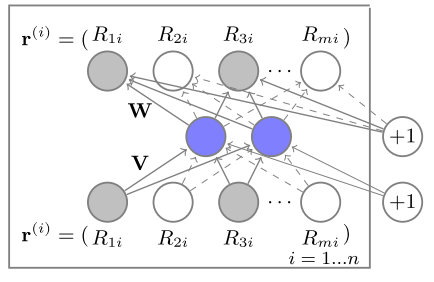

# 推荐系统之AutoRec

## 网络模型



```python
class AutoRec(nn.Module):
    """
    基于物品的AutoRec模型
    """
    
    def __init__(self, num_items, hidden_units, lambd):
        super(AutoRec, self).__init__()
        self._num_items = num_items
        self._hidden_units = hidden_units
        self._lambda_value = lambd

        # 定义编码器结构
        self._encoder = nn.Sequential(
            nn.Linear(self._num_items, self._hidden_units),
            nn.Sigmoid()
        )
        # 定义解码器结构
        self._decoder = nn.Sequential(
            nn.Linear(self._hidden_units, self._num_items)
        )

    def forward(self, input):
        return self._decoder(self._encoder(input))
```


```python
model = AutoRec(num_items=100, hidden_units=7, lambd=1)
# input_size: items(物品数量)*users(用户数量)
summary(model, input_size=(10000, 100), batch_size=1, device="cpu")
```

    ----------------------------------------------------------------
            Layer (type)               Output Shape         Param #
    ================================================================
                Linear-1              [1, 10000, 7]             707
               Sigmoid-2              [1, 10000, 7]               0
                Linear-3            [1, 10000, 100]             800
    ================================================================
    Total params: 1,507
    Trainable params: 1,507
    Non-trainable params: 0
    ----------------------------------------------------------------
    Input size (MB): 3.81
    Forward/backward pass size (MB): 8.70
    Params size (MB): 0.01
    Estimated Total Size (MB): 12.52
    ----------------------------------------------------------------


## L2损失（防止过拟合）


```python
def loss(self, res, input, mask, optimizer):
    cost = 0
    temp = 0

    cost += ((res - input) * mask).pow(2).sum()
    rmse = cost

    for i in optimizer.param_groups:
        # 找到权重矩阵V和W，并且计算平方和，用于约束项。
        for j in i['params']:
            if j.data.dim() == 2:
                temp += torch.t(j.data).pow(2).sum()

    cost += temp * self._config['lambda'] * 0.5
    return cost, rmse
```

## 评估


```python
def recommend_user(self, r_u, N):
    """
    :param r_u: 单个用户对所有物品的评分向量
    :param N: 推荐的商品个数
    """
    
    # 得到用户对所有物品的评分
    predict = self.forward(torch.from_numpy(r_u).float())
    predict = predict.detach().numpy()
    indexs = np.argsort(-predict)[:N]
    return indexs

def recommend_item(self, user, test_r, N):
    """
    :param r_u: 所有用户对物品i的评分向量
    :param N: 推荐的商品个数
    """
    
    # 保存给user的推荐列表
    recommends = np.array([])

    for i in range(test_r.shape[1]):
        predict = self.forward(test_r[:, i])
        recommends.append(predict[user])

    # 按照逆序对推荐列表排序，得到最大的N个值的索引
    indexs = np.argsot(-recommends)[:N]
    # 按照用户对物品i的评分降序排序吗，推荐前N个物品给到用户
    return recommends[indexs]
```

# 总结

1）相比于I-AutoRec来讲，U-AutoRec的优势在于只需要一次计算就能得到一个用户对所有物品的评分，方便推荐排序。

2）优化后的模型有一定的泛化能力，但是由于模型结构比较简单，存在一定的表达能力不足的情况

# 参考

[NetWork](https://github.com/HeartbreakSurvivor/RsAlgorithms/blob/main/AutoRec/network.py)
