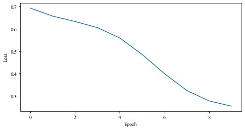
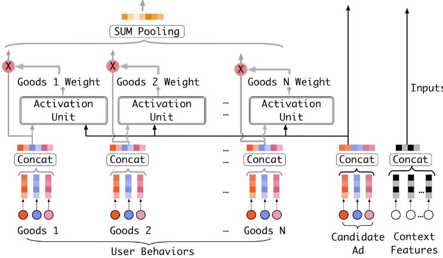
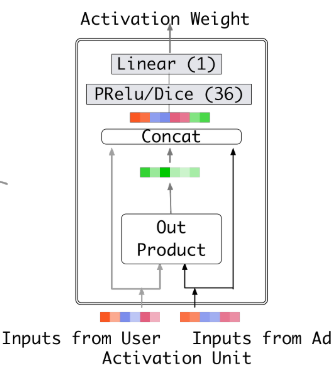
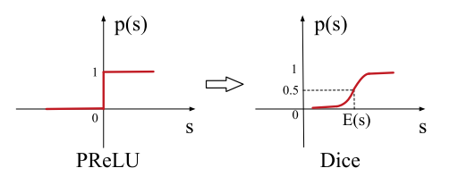
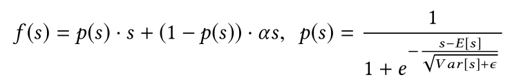
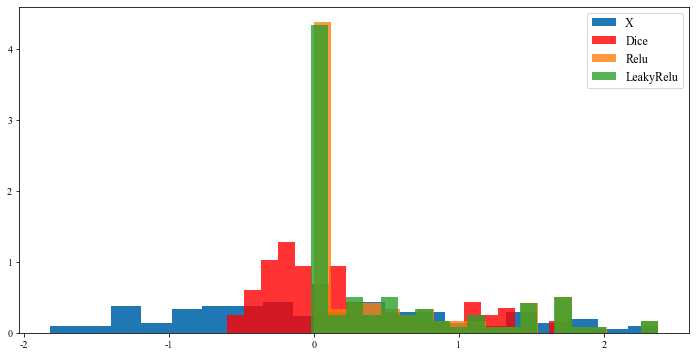
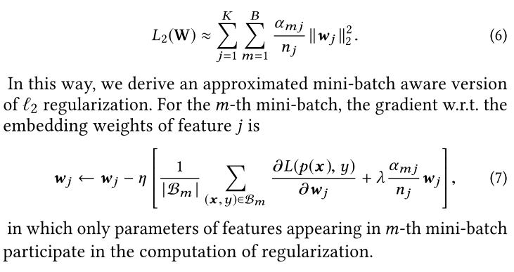

# DIN


```python
import sys
sys.path.insert(0, '..')
import numpy as np
import torch
from torch import nn
from deepctr_torch.inputs import (DenseFeat, SparseFeat, VarLenSparseFeat,
                                  get_feature_names)

from deepctr_torch.models.din import DIN
import pandas as pd
import matplotlib.pyplot as plt
import numpy as np
from matplotlib import rcParams
config = {
    "font.family":'Times New Roman',  # 设置字体类型
}
rcParams.update(config)
```

## 算法实例


```python
import sys

sys.path.insert(0, '..')

import numpy as np
import torch
from deepctr_torch.inputs import (DenseFeat, SparseFeat, VarLenSparseFeat,
                                  get_feature_names)

from deepctr_torch.models.din import DIN
```

### 数据格式准备


```python
feature_columns = [SparseFeat('user', 3, embedding_dim=8), SparseFeat('gender', 2, embedding_dim=8),
                   SparseFeat('item', 3 + 1, embedding_dim=8), SparseFeat('item_gender', 2 + 1, embedding_dim=8),
                   DenseFeat('score', 1)]

feature_columns += [VarLenSparseFeat(SparseFeat('hist_item', 3 + 1, embedding_dim=8), 4, length_name="seq_length"),
                    VarLenSparseFeat(SparseFeat('hist_item_gender', 2 + 1, embedding_dim=8), 4, length_name="seq_length")]

behavior_feature_list = ["item", "item_gender"]
```


```python
feature_columns
```


    [SparseFeat(name='user', vocabulary_size=3, embedding_dim=8, use_hash=False, dtype='int32', embedding_name='user', group_name='default_group'),
     SparseFeat(name='gender', vocabulary_size=2, embedding_dim=8, use_hash=False, dtype='int32', embedding_name='gender', group_name='default_group'),
     SparseFeat(name='item', vocabulary_size=4, embedding_dim=8, use_hash=False, dtype='int32', embedding_name='item', group_name='default_group'),
     SparseFeat(name='item_gender', vocabulary_size=3, embedding_dim=8, use_hash=False, dtype='int32', embedding_name='item_gender', group_name='default_group'),
     DenseFeat(name='score', dimension=1, dtype='float32'),
     VarLenSparseFeat(sparsefeat=SparseFeat(name='hist_item', vocabulary_size=4, embedding_dim=8, use_hash=False, dtype='int32', embedding_name='hist_item', group_name='default_group'), maxlen=4, combiner='mean', length_name='seq_length'),
     VarLenSparseFeat(sparsefeat=SparseFeat(name='hist_item_gender', vocabulary_size=3, embedding_dim=8, use_hash=False, dtype='int32', embedding_name='hist_item_gender', group_name='default_group'), maxlen=4, combiner='mean', length_name='seq_length')]


```python
# 数据类型为ndarry类型
uid = np.array([0, 1, 2])
ugender = np.array([0, 1, 0])
iid = np.array([1, 2, 3])  # 0 is mask value
igender = np.array([1, 2, 1])  # 0 is mask value
score = np.array([0.1, 0.2, 0.3])

hist_iid = np.array([[1, 2, 3, 0], [1, 2, 3, 0], [1, 2, 0, 0]])
hist_igender = np.array([[1, 1, 2, 0], [2, 1, 1, 0], [2, 1, 0, 0]])

# 统计用户的历史行为真实长度
behavior_length = np.array([3, 3, 2])
```


```python
feature_dict = {'user': uid, 'gender': ugender, 'item': iid, 'item_gender': igender,
                'hist_item': hist_iid, 'hist_item_gender': hist_igender, 'score': score,
                "seq_length": behavior_length}
```


```python
get_feature_names(feature_columns)
```


    ['user',
     'gender',
     'item',
     'item_gender',
     'score',
     'hist_item',
     'seq_length',
     'hist_item_gender']


```python
x = {name: feature_dict[name] for name in get_feature_names(feature_columns)}
y = np.array([1, 0, 1])
```


```python
x
```


    {'user': array([0, 1, 2]),
     'gender': array([0, 1, 0]),
     'item': array([1, 2, 3]),
     'item_gender': array([1, 2, 1]),
     'score': array([0.1, 0.2, 0.3]),
     'hist_item': array([[1, 2, 3, 0],
            [1, 2, 3, 0],
            [1, 2, 0, 0]]),
     'seq_length': array([3, 3, 2]),
     'hist_item_gender': array([[1, 1, 2, 0],
            [2, 1, 1, 0],
            [2, 1, 0, 0]])}

### 模型构建


```python
device = 'cpu'
use_cuda = False
if use_cuda and torch.cuda.is_available():
    print('cuda ready...')
    device = 'cuda:0'

model = DIN(feature_columns, behavior_feature_list, device=device, att_weight_normalization=True)
model.compile('adagrad', 'binary_crossentropy',
              metrics=['binary_crossentropy', "auc"])
model
```


    DIN(
      (embedding_dict): ModuleDict(
        (gender): Embedding(2, 8)
        (hist_item): Embedding(4, 8)
        (hist_item_gender): Embedding(3, 8)
        (item): Embedding(4, 8)
        (item_gender): Embedding(3, 8)
        (user): Embedding(3, 8)
      )
      (linear_model): Linear(
        (embedding_dict): ModuleDict()
      )
      (out): PredictionLayer()
      (attention): AttentionSequencePoolingLayer(
        (local_att): LocalActivationUnit(
          (dnn): DNN(
            (dropout): Dropout(p=0, inplace=False)
            (linears): ModuleList(
              (0): Linear(in_features=64, out_features=64, bias=True)
              (1): Linear(in_features=64, out_features=16, bias=True)
            )
            (activation_layers): ModuleList(
              (0): Dice(
                (bn): BatchNorm1d(64, eps=1e-08, momentum=0.1, affine=True, track_running_stats=True)
                (sigmoid): Sigmoid()
              )
              (1): Dice(
                (bn): BatchNorm1d(16, eps=1e-08, momentum=0.1, affine=True, track_running_stats=True)
                (sigmoid): Sigmoid()
              )
            )
          )
          (dense): Linear(in_features=16, out_features=1, bias=True)
        )
      )
      (dnn): DNN(
        (dropout): Dropout(p=0, inplace=False)
        (linears): ModuleList(
          (0): Linear(in_features=49, out_features=256, bias=True)
          (1): Linear(in_features=256, out_features=128, bias=True)
        )
        (activation_layers): ModuleList(
          (0): ReLU(inplace=True)
          (1): ReLU(inplace=True)
        )
      )
      (dnn_linear): Linear(in_features=128, out_features=1, bias=False)
    )

### 模型训练与评估


```python
history = model.fit(x, y, batch_size=3, epochs=10, verbose=2, validation_split=0.0)
```

    cpu
    Train on 3 samples, validate on 0 samples, 1 steps per epoch
    Epoch 1/10
    0s - loss:  0.6928 - binary_crossentropy:  0.6928 - auc:  0.5000
    Epoch 2/10
    0s - loss:  0.6565 - binary_crossentropy:  0.6565 - auc:  0.5000
    Epoch 3/10
    0s - loss:  0.6327 - binary_crossentropy:  0.6327 - auc:  1.0000
    Epoch 4/10
    0s - loss:  0.6050 - binary_crossentropy:  0.6050 - auc:  1.0000
    Epoch 5/10
    0s - loss:  0.5592 - binary_crossentropy:  0.5592 - auc:  1.0000
    Epoch 6/10
    0s - loss:  0.4849 - binary_crossentropy:  0.4849 - auc:  1.0000
    Epoch 7/10
    0s - loss:  0.3986 - binary_crossentropy:  0.3986 - auc:  1.0000
    Epoch 8/10
    0s - loss:  0.3231 - binary_crossentropy:  0.3231 - auc:  1.0000
    Epoch 9/10
    0s - loss:  0.2762 - binary_crossentropy:  0.2762 - auc:  1.0000
    Epoch 10/10
    0s - loss:  0.2528 - binary_crossentropy:  0.2528 - auc:  1.0000

```python
plt.figure(figsize=(8, 4))
plt.plot(history.history["loss"])
plt.xlabel("Epoch")
plt.ylabel("Loss")
plt.savefig("./imgs/loss.png")
plt.show()    

    
```


## DIN模型解析
### 模型架构


## 源码分析
### DIN网络


```python
class BaseModel:
    pass


class DIN(BaseModel):
    """Instantiates the Deep Interest Network architecture.

    :param dnn_feature_columns: An iterable containing all the features used by deep part of the model.
    :param history_feature_list: list,to indicate  sequence sparse field
    :param dnn_use_bn: bool. Whether use BatchNormalization before activation or not in deep net
    :param dnn_hidden_units: list,list of positive integer or empty list, the layer number and units in each layer of deep net
    :param dnn_activation: Activation function to use in deep net
    :param att_hidden_size: list,list of positive integer , the layer number and units in each layer of attention net
    :param att_activation: Activation function to use in attention net
    :param att_weight_normalization: bool. Whether normalize the attention score of local activation unit.
    :param l2_reg_dnn: float. L2 regularizer strength applied to DNN
    :param l2_reg_embedding: float. L2 regularizer strength applied to embedding vector
    :param dnn_dropout: float in [0,1), the probability we will drop out a given DNN coordinate.
    :param init_std: float,to use as the initialize std of embedding vector
    :param seed: integer ,to use as random seed.
    :param task: str, ``"binary"`` for  binary logloss or  ``"regression"`` for regression loss
    :return:  A PyTorch model instance.

    """

    def __init__(self, dnn_feature_columns, history_feature_list, dnn_use_bn=False,
                 dnn_hidden_units=(256, 128), dnn_activation='relu', att_hidden_size=(64, 16),
                 att_activation='Dice', att_weight_normalization=False, l2_reg_dnn=0.0,
                 l2_reg_embedding=1e-6, dnn_dropout=0, init_std=0.0001,
                 seed=1024, task='binary', device='cpu'):
        super(DIN, self).__init__([], dnn_feature_columns, l2_reg_linear=0, l2_reg_embedding=l2_reg_embedding,
                                  init_std=init_std, seed=seed, task=task, device=device)

        self.sparse_feature_columns = list(
            filter(lambda x: isinstance(x, SparseFeat), dnn_feature_columns)) if dnn_feature_columns else []
        self.varlen_sparse_feature_columns = list(
            filter(lambda x: isinstance(x, VarLenSparseFeat), dnn_feature_columns)) if dnn_feature_columns else []

        # 用户历史记录特征
        self.history_feature_list = history_feature_list

        self.history_feature_columns = []
        self.sparse_varlen_feature_columns = []
        self.history_fc_names = list(map(lambda x: "hist_" + x, history_feature_list))

        for fc in self.varlen_sparse_feature_columns:
            feature_name = fc.name
            if feature_name in self.history_fc_names:
                self.history_feature_columns.append(fc)
            else:
                self.sparse_varlen_feature_columns.append(fc)

        att_emb_dim = self._compute_interest_dim()

        self.attention = AttentionSequencePoolingLayer(att_hidden_units=att_hidden_size,
                                                       embedding_dim=att_emb_dim,
                                                       att_activation=att_activation,
                                                       return_score=False,
                                                       supports_masking=False,
                                                       weight_normalization=att_weight_normalization)

        self.dnn = DNN(inputs_dim=self.compute_input_dim(dnn_feature_columns),
                       hidden_units=dnn_hidden_units,
                       activation=dnn_activation,
                       dropout_rate=dnn_dropout,
                       l2_reg=l2_reg_dnn,
                       use_bn=dnn_use_bn)
        
        self.dnn_linear = nn.Linear(dnn_hidden_units[-1], 1, bias=False).to(device)
        self.to(device)


    def forward(self, X):
        _, dense_value_list = self.input_from_feature_columns(X, self.dnn_feature_columns, self.embedding_dict)

        # sequence pooling part
        # 查找embedding_lookup找到相对应的embedding向量
        # B * 候选物品　* E
        query_emb_list = embedding_lookup(X, self.embedding_dict, self.feature_index, self.sparse_feature_columns,
                                          return_feat_list=self.history_feature_list, to_list=True)

        # B * 历史记录数据数目 * E
        keys_emb_list = embedding_lookup(X, self.embedding_dict, self.feature_index, self.history_feature_columns,
                                         return_feat_list=self.history_fc_names, to_list=True)

        dnn_input_emb_list = embedding_lookup(X, self.embedding_dict, self.feature_index, self.sparse_feature_columns,
                                              to_list=True)

        # 稀疏向量
        sequence_embed_dict = varlen_embedding_lookup(X, self.embedding_dict, self.feature_index,
                                                      self.sparse_varlen_feature_columns)


        sequence_embed_list = get_varlen_pooling_list(sequence_embed_dict, X, self.feature_index,
                                                      self.sparse_varlen_feature_columns, self.device)

        dnn_input_emb_list += sequence_embed_list
        # dnn的输入
        deep_input_emb = torch.cat(dnn_input_emb_list, dim=-1)

        # concatenate, 不同特征合并到一起
        query_emb = torch.cat(query_emb_list, dim=-1)                     # [B, 1, E]
        keys_emb = torch.cat(keys_emb_list, dim=-1)                       # [B, T, E]

        # 历史记录长度的名称
        keys_length_feature_name = [feat.length_name for feat in self.varlen_sparse_feature_columns if
                                    feat.length_name is not None]

        # 历史数据的真实长度,用bool值表示
        # self.feature_index : OrderedDict([('user', (0, 1)), ('gender', (1, 2)), ('item', (2, 3)), ('item_gender', (3, 4)), ('score', (4, 5))
        # , ('hist_item', (5, 9)), ('seq_length', (9, 10)), ('hist_item_gender', (10, 14))])
        keys_length = torch.squeeze(maxlen_lookup(X, self.feature_index, keys_length_feature_name), 1)  # [B, 1]

        hist = self.attention(query_emb, keys_emb, keys_length)           # [B, 1, E]

        # deep part
        deep_input_emb = torch.cat((deep_input_emb, hist), dim=-1)
        deep_input_emb = deep_input_emb.view(deep_input_emb.size(0), -1)

        dnn_input = combined_dnn_input([deep_input_emb], dense_value_list)
        dnn_output = self.dnn(dnn_input)
        dnn_logit = self.dnn_linear(dnn_output)

        y_pred = self.out(dnn_logit)

        return y_pred

    def _compute_interest_dim(self):
        interest_dim = 0
        for feat in self.sparse_feature_columns:
            if feat.name in self.history_feature_list:
                interest_dim += feat.embedding_dim
        return interest_dim
```

### Attention Sequence PoolingLayer
目的：完成加权的SUM Pooling操作  



```python
class AttentionSequencePoolingLayer(nn.Module):
    """The Attentional sequence pooling operation used in DIN & DIEN.

        Arguments
          - **att_hidden_units**:list of positive integer, the attention net layer number and units in each layer.

          - **att_activation**: Activation function to use in attention net.

          - **weight_normalization**: bool.Whether normalize the attention score of local activation unit.

          - **supports_masking**:If True,the input need to support masking.

        References
          - [Zhou G, Zhu X, Song C, et al. Deep interest network for click-through rate prediction[C]//Proceedings of the 24th ACM SIGKDD International Conference on Knowledge Discovery & Data Mining. ACM, 2018: 1059-1068.](https://arxiv.org/pdf/1706.06978.pdf)
      """

    def __init__(self, att_hidden_units=(80, 40), att_activation='sigmoid', weight_normalization=False,
                 return_score=False, supports_masking=False, embedding_dim=4, **kwargs):
        
        super(AttentionSequencePoolingLayer, self).__init__()
        self.return_score = return_score
        self.weight_normalization = weight_normalization
        self.supports_masking = supports_masking
        self.local_att = LocalActivationUnit(hidden_units=att_hidden_units, embedding_dim=embedding_dim,
                                             activation=att_activation,
                                             dropout_rate=0, use_bn=False)

    def forward(self, query, keys, keys_length, mask=None):
        """
        Input shape
          - A list of three tensor: [query,keys,keys_length]

          - query is a 3D tensor with shape:  ``(batch_size, 1, embedding_size)``

          - keys is a 3D tensor with shape:   ``(batch_size, T, embedding_size)``

          - keys_length is a 2D tensor with shape: ``(batch_size, 1)``

        Output shape
          - 3D tensor with shape: ``(batch_size, 1, embedding_size)``.
        """
        # max_length 为序列长度(也即填补完后的序列长度)
        batch_size, max_length, dim = keys.size()

        # Mask
        if self.supports_masking:
            if mask is None:
                raise ValueError("When supports_masking=True,input must support masking")
            keys_masks = mask.unsqueeze(1)
        else:
            keys_masks = torch.arange(max_length, device=keys_length.device, dtype=keys_length.dtype).repeat(batch_size,
                                                                                                            1)  # [B, T]
            # 设置有效的序列
            keys_masks = keys_masks < keys_length.view(-1, 1)  # 0, 1 mask
            keys_masks = keys_masks.unsqueeze(1)  # [B, 1, T]
        
        # 计算注意力分数
        attention_score = self.local_att(query, keys)  # [B, T, 1]
        
        # outouts 为每一个query和相对应的key所计算结果值(T历史序列长度)
        outputs = torch.transpose(attention_score, 1, 2)  # [B, 1, T]

        if self.weight_normalization:
            paddings = torch.ones_like(outputs) * (-2 ** 32 + 1)
        else:
            paddings = torch.zeros_like(outputs)

        outputs = torch.where(keys_masks, outputs, paddings)  # [B, 1, T]

        # Scale
        # outputs = outputs / (keys.shape[-1] ** 0.05)

        if self.weight_normalization:
            outputs = F.softmax(outputs, dim=-1)  # [B, 1, T]

        if not self.return_score:
            # Weighted sum
            outputs = torch.matmul(outputs, keys)  # [B, 1, E]

        return outputs
```

### LocalActivationUnit
目的：使用query去查询每一个key得到相对应的注意力权重。




```python
class LocalActivationUnit(nn.Module):
    """The LocalActivationUnit used in DIN with which the representation of
        user interests varies adaptively given different candidate items.

    Input shape
        - A list of two 3D tensor with shape:  ``(batch_size, 1, embedding_size)`` and ``(batch_size, T, embedding_size)``

    Output shape
        - 3D tensor with shape: ``(batch_size, T, 1)``.

    Arguments
        - **hidden_units**:list of positive integer, the attention net layer number and units in each layer.

        - **activation**: Activation function to use in attention net.

        - **l2_reg**: float between 0 and 1. L2 regularizer strength applied to the kernel weights matrix of attention net.

        - **dropout_rate**: float in [0,1). Fraction of the units to dropout in attention net.

        - **use_bn**: bool. Whether use BatchNormalization before activation or not in attention net.

        - **seed**: A Python integer to use as random seed.

    References
        - [Zhou G, Zhu X, Song C, et al. Deep interest network for click-through rate prediction[C]//Proceedings of the 24th ACM SIGKDD International Conference on Knowledge Discovery & Data Mining. ACM, 2018: 1059-1068.](https://arxiv.org/pdf/1706.06978.pdf)
    """

    def __init__(self, hidden_units=(64, 32), embedding_dim=4, activation='sigmoid', dropout_rate=0, dice_dim=3,
                 l2_reg=0, use_bn=False):
        super(LocalActivationUnit, self).__init__()

        self.dnn = DNN(inputs_dim=4 * embedding_dim,
                       hidden_units=hidden_units,
                       activation=activation,
                       l2_reg=l2_reg,
                       dropout_rate=dropout_rate,
                       dice_dim=dice_dim,
                       use_bn=use_bn)

        self.dense = nn.Linear(hidden_units[-1], 1)

    def forward(self, query, user_behavior):
        # query ad            : size -> batch_size * 1 * embedding_size
        # user behavior       : size -> batch_size * time_seq_len * embedding_size

        # 使用query值去查询每一个key值
        user_behavior_len = user_behavior.size(1)
        
        # B*user_behavior*embeddind_size
        queries = query.expand(-1, user_behavior_len, -1)

        attention_input = torch.cat([queries, user_behavior, queries - user_behavior, queries * user_behavior],
                                    dim=-1)  # as the source code, subtraction simulates verctors' difference
        attention_output = self.dnn(attention_input)

        attention_score = self.dense(attention_output)  # [B, T, 1]

        return attention_score
```

### DNN


```python
class DNN(nn.Module):
    """The Multi Layer Percetron

      Input shape
        - nD tensor with shape: ``(batch_size, ..., input_dim)``. The most common situation would be a 2D input with shape ``(batch_size, input_dim)``.

      Output shape
        - nD tensor with shape: ``(batch_size, ..., hidden_size[-1])``. For instance, for a 2D input with shape ``(batch_size, input_dim)``, the output would have shape ``(batch_size, hidden_size[-1])``.

      Arguments
        - **inputs_dim**: input feature dimension.

        - **hidden_units**:list of positive integer, the layer number and units in each layer.

        - **activation**: Activation function to use.

        - **l2_reg**: float between 0 and 1. L2 regularizer strength applied to the kernel weights matrix.

        - **dropout_rate**: float in [0,1). Fraction of the units to dropout.

        - **use_bn**: bool. Whether use BatchNormalization before activation or not.

        - **seed**: A Python integer to use as random seed.
    """

    def __init__(self, inputs_dim, hidden_units, activation='relu', l2_reg=0, dropout_rate=0, use_bn=False,
                 init_std=0.0001, dice_dim=3, seed=1024, device='cpu'):
        
        super(DNN, self).__init__()
        self.dropout_rate = dropout_rate
        self.dropout = nn.Dropout(dropout_rate)
        self.seed = seed
        self.l2_reg = l2_reg
        self.use_bn = use_bn
        if len(hidden_units) == 0:
            raise ValueError("hidden_units is empty!!")
        hidden_units = [inputs_dim] + list(hidden_units)

        self.linears = nn.ModuleList(
            [nn.Linear(hidden_units[i], hidden_units[i + 1]) for i in range(len(hidden_units) - 1)])

        if self.use_bn:
            self.bn = nn.ModuleList(
                [nn.BatchNorm1d(hidden_units[i + 1]) for i in range(len(hidden_units) - 1)])

        self.activation_layers = nn.ModuleList(
            [activation_layer(activation, hidden_units[i + 1], dice_dim) for i in range(len(hidden_units) - 1)])

        for name, tensor in self.linears.named_parameters():
            if 'weight' in name:
                nn.init.normal_(tensor, mean=0, std=init_std)

        self.to(device)

    def forward(self, inputs):
        deep_input = inputs

        for i in range(len(self.linears)):

            fc = self.linears[i](deep_input)

            if self.use_bn:
                fc = self.bn[i](fc)

            fc = self.activation_layers[i](fc)

            fc = self.dropout(fc)
            deep_input = fc
            
        return deep_input

```

### Dice激活函数
**控制函数:**  
  
**激活函数:**  
  
**解释:** 其中，E[s]和Var[s]是每个mini-batch输入的均值和方差。ϵ是一个非常小的常数10-8，其值设置为。Dice主要思想是根据输入数据的分布，自适应地调整校正点，使其值为输入的均值。当E[s]和Var[s]均为0时，Dice和PReLU是等价的。  


```python
class Dice(nn.Module):
    """The Data Adaptive Activation Function in DIN,which can be viewed as a generalization of PReLu and can adaptively adjust the rectified point according to distribution of input data.

    Input shape:
        - 2 dims: [batch_size, embedding_size(features)]
        - 3 dims: [batch_size, num_features, embedding_size(features)]

    Output shape:
        - Same shape as input.
    
    References
        - [Zhou G, Zhu X, Song C, et al. Deep interest network for click-through rate prediction[C]//Proceedings of the 24th ACM SIGKDD International Conference on Knowledge Discovery & Data Mining. ACM, 2018: 1059-1068.](https://arxiv.org/pdf/1706.06978.pdf)
        - https://github.com/zhougr1993/DeepInterestNetwork, https://github.com/fanoping/DIN-pytorch
    """
    
    def __init__(self, emb_size, dim=2, epsilon=1e-8, device='cpu'):
        super(Dice, self).__init__()
        assert dim == 2 or dim == 3
        
        # 使用BN1d进行计算
        self.bn = nn.BatchNorm1d(emb_size, eps=epsilon)
        self.sigmoid = nn.Sigmoid()
        self.dim = dim

        if self.dim == 2:
            self.alpha = torch.zeros((emb_size,)).to(device)
        else:
            self.alpha = torch.zeros((emb_size, 1)).to(device)

    def forward(self, x):
        
        assert x.dim() == self.dim
        if self.dim == 2:
            x_p = self.sigmoid(self.bn(x))
            out = self.alpha * (1 - x_p) * x + x_p * x
        else:
            x = torch.transpose(x, 1, 2)
            x_p = self.sigmoid(self.bn(x))
            out = self.alpha * (1 - x_p) * x + x_p * x
            out = torch.transpose(out, 1, 2)
        
        return out
```


```python
# 数据处理
dice = Dice(100)
ipt_x = torch.randn((2, 100))
```


```python
# 激活函数
out = dice(ipt_x)
out_relu = torch.relu(ipt_x)
LeakyReLU = torch.nn.LeakyReLU()
out_prelu = LeakyReLU(ipt_x)
```


```python
plt.figure(figsize=(14, 7))
plt.plot(np.arange(1, 101), ipt_x[0].detach().numpy(), c="b", label="X")
plt.plot(np.arange(1, 101), out[0].detach().numpy(), c="r", label="Dice")
plt.plot(np.arange(1, 101), out_relu[0].detach().numpy(), label="Relu")
plt.plot(np.arange(1, 101), out_prelu[0].detach().numpy(), label="LeakyRelu")
plt.legend(fontsize=12)
plt.savefig("./imgs/act.png")
plt.show()
```


    


```python
plt.figure(figsize=(12, 6))
plt.hist(ipt_x[0].data.numpy(), bins=20, density=True, label="X")
plt.hist(out[0].data.numpy(), bins=20, color="r",alpha=0.8, density=True, label="Dice")
plt.hist(out_relu[0].detach().numpy(), bins=20,alpha=0.8, density=True, label="Relu")
plt.hist(out_prelu[0].detach().numpy(), bins=20,alpha=0.8, density=True, label="LeakyRelu")
plt.legend(fontsize=12)
plt.show()
```


​    

​    


### BatchNorm1d代码剖析


```python
def fowardbn(x, gam, beta, ):
    """
    实现一维批量归一化
    """
    
    momentum = 0.1
    eps = 1e-05
    running_mean = 0
    running_var = 1
    running_mean = (1 - momentum) * running_mean + momentum * x.mean(dim=0)
    running_var = (1 - momentum) * running_var + momentum * x.var(dim=0)
    #计算同一Batch中同属维度下的方差和均值
    mean = x.mean(dim=0)
    var = x.var(dim=0,unbiased=False)
    # bnmiddle_buffer = (input - mean) / ((var + eps) ** 0.5).data
    x_hat = (x - mean) / torch.sqrt(var + eps)
    out = gam * x_hat + beta
    cache = (x, gam, beta, x_hat, mean, var, eps)
    return out, cache

model2 = nn.BatchNorm1d(5)
input1 = torch.randn(3, 5, requires_grad=True)
input2 = input1.clone().detach().requires_grad_()

x = model2(input1)
out, cache = fowardbn(input2, model2.weight, model2.bias)
out
```


    tensor([[-1.1404,  0.1805,  0.9217, -1.3147,  0.6043],
            [ 1.2944,  1.1245,  0.4681,  1.1087,  0.8051],
            [-0.1540, -1.3049, -1.3897,  0.2059, -1.4095]], grad_fn=<AddBackward0>)


```python
x
```


    tensor([[-1.1404,  0.1805,  0.9217, -1.3147,  0.6043],
            [ 1.2944,  1.1245,  0.4681,  1.1087,  0.8051],
            [-0.1540, -1.3049, -1.3897,  0.2059, -1.4095]],
           grad_fn=<NativeBatchNormBackward>)


```python
cache
```


    (tensor([[ 0.2737,  0.1168,  0.7870, -1.5751,  0.2671],
             [ 1.0392,  0.6373,  0.4522,  2.1193,  0.5764],
             [ 0.5839, -0.7021, -0.9193,  0.7430, -2.8346]], requires_grad=True),
     Parameter containing:
     tensor([1., 1., 1., 1., 1.], requires_grad=True),
     Parameter containing:
     tensor([0., 0., 0., 0., 0.], requires_grad=True),
     tensor([[-1.1404,  0.1805,  0.9217, -1.3147,  0.6043],
             [ 1.2944,  1.1245,  0.4681,  1.1087,  0.8051],
             [-0.1540, -1.3049, -1.3897,  0.2059, -1.4095]], grad_fn=<DivBackward0>),
     tensor([ 0.6323,  0.0173,  0.1066,  0.4291, -0.6637], grad_fn=<MeanBackward1>),
     tensor([0.0988, 0.3040, 0.5449, 2.3241, 2.3724], grad_fn=<VarBackward1>),
     1e-05)


```python
input1.mean(axis=0)
```


    tensor([ 0.6323,  0.0173,  0.1066,  0.4291, -0.6637], grad_fn=<MeanBackward1>)


### MBA


## 评价指标
用户加权的AUC指标

</h2><ul><li>先获取推荐系统为每一个用户预测的推荐列表，包含score值</li><li>按score值对推荐列表进行升序排列</li><li>根据ground-truth(用户点没点)来给每个正样本标记rank值</li><li>根据以下公式计算uAUC值，其中n1为正样本的个数，n0为负样本的个数，rank(i)为第i个正样本的rank值</li></ul><p> </p><ul><li>计算所有用户的AUC值如下：</li></ul><p> </p><p>在阿里的DIN论文里，利用用户的曝光数对uAUC进行加权，可以很好地衡量线上性能：</p><p> </p></div>

## 参考
[论文](https://arxiv.org/abs/1706.06978)  
[DeepCTR-Torch](https://github.com/shenweichen/DeepCTR-Torch)  
[Pytorch-BN层详细解读](https://blog.csdn.net/ECNU_LZJ/article/details/104203604)  
[推荐系统之AUC评价指标](https://zhuanlan.zhihu.com/p/73335362)  
[推荐系统遇上深度学习(十八)--探秘阿里之深度兴趣网络](https://cloud.tencent.com/developer/article/1164761)
