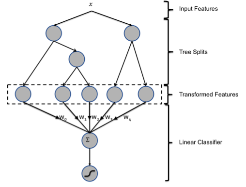
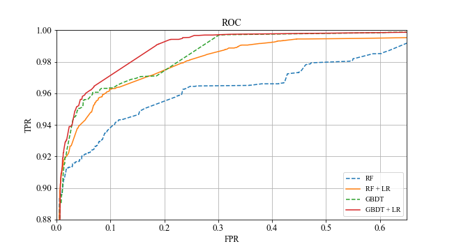

# GBDT+LR系列（组合高阶特征）

**模型示意图：**  
通过GBDT生成的特征，可直接作为LR的特征使用，省去人工处理分析特征的环节，LR的输入特征完全依赖于通过GBDT得到的特征通过GBDT生成的特征，可直接作为LR的特征使用，省去人工处理分析特征的环节，LR的输入特征完全依赖于通过GBDT得到的特征。  
  
**思考：**　　

1）为什么要使用集成的决策树模型，而不是单棵的决策树模型：一棵树的表达能力很弱，不足以表达多个有区分性的特征组合，多棵树的表达能力更强一些，可以更好的发现有效的特征和特征组合。　　
2）为什么建树采用GBDT而非RF：RF也是多棵树，但从效果上有实践证明不如GBDT。且GBDT前面的树，特征分裂主要体现对多数样本有区分度的特征；后面的树，主要体现的是经过前N颗树，残差仍然较大的少数样本。优先选用在整体上有区分度的特征，再选用针对少数样本有区分度的特征，思路更加合理，这应该也是用GBDT的原因。

## GBDT+LR（原始模型）


```python
import numpy as np
np.random.seed(10)
import pandas as pd
import matplotlib.pyplot as plt
from sklearn.datasets import make_classification
from sklearn.linear_model import LogisticRegression
from sklearn.ensemble import (RandomTreesEmbedding, RandomForestClassifier,
                              GradientBoostingClassifier)
from sklearn.preprocessing import OneHotEncoder
from sklearn.model_selection import train_test_split
from sklearn.metrics import roc_curve
from sklearn.pipeline import make_pipeline

from matplotlib import rcParams
config = {
    "font.family":'Times New Roman',  # 设置字体类型
}

rcParams.update(config)
```


```python
n_estimator = 10
X, y = make_classification(n_samples=80000)
X_train, X_test, y_train, y_test = train_test_split(X, y
                                                    , test_size = 0.2
                                                   )

X_train, X_train_lr, y_train, y_train_lr = train_test_split(X_train, y_train
                                                            , test_size=0.2
                                                           )
```


```python
# 初始化模型
grd = GradientBoostingClassifier(n_estimators=n_estimator)
grd_enc = OneHotEncoder()
grd_lm = LogisticRegression(max_iter=1000)
```


```python
grd.fit(X_train, y_train)  #GBDT建模
grd_enc.fit(grd.apply(X_train)[:, :, 0])  #编码OneHot向量[[1, 5, 6, 22......], [4, 5, 6, 2......]]
grd_lm.fit(grd_enc.transform(grd.apply(X_train_lr)[:, :, 0]), y_train_lr)
```

## RandomForest+LR（变体）


```python
rf = RandomForestClassifier(max_depth=3, n_estimators=n_estimator)
rf_enc = OneHotEncoder()
rf_lm = LogisticRegression(max_iter=1000)
```


```python
# 训练 model
rf.fit(X_train, y_train)
rf_enc.fit(rf.apply(X_train))
rf_lm.fit(rf_enc.transform(rf.apply(X_train_lr)), y_train_lr)
```


```python
# 每棵子树的叶子结点的个数
[ tree.get_n_leaves() for tree in rf.estimators_ ]
```


    [8, 8, 8, 8, 8, 8, 8, 5, 8, 8]


```python
# 编码RF输出为OneHot向量
rf_enc.transform(rf.apply(X_train_lr)).toarray()
```


    array([[0., 0., 0., ..., 0., 0., 0.],
           [0., 0., 1., ..., 0., 0., 0.],
           [0., 0., 0., ..., 1., 0., 0.],
           ...,
           [1., 0., 0., ..., 0., 0., 0.],
           [0., 0., 0., ..., 0., 0., 0.],
           [0., 0., 0., ..., 0., 0., 0.]])

## ROC曲线比较


```python
# GBDT+LR
y_pred_grd_lm = grd_lm.predict_proba(grd_enc.transform(grd.apply(X_test)[:, :, 0]))[:, 1]
fpr_grd_lm, tpr_grd_lm, _ = roc_curve(y_test, y_pred_grd_lm)

# GBDT
y_pred_grd = grd.predict_proba(X_test)[:, 1]
fpr_grd, tpr_grd, _ = roc_curve(y_test, y_pred_grd)

# RF
y_pred_rf = rf.predict_proba(X_test)[:, 1]
fpr_rf, tpr_rf, _ = roc_curve(y_test, y_pred_rf)

# RF+LR
y_pred_rf_lm = rf_lm.predict_proba(rf_enc.transform(rf.apply(X_test)))
fpr_rf_lm, tpr_rf_lm, _ = roc_curve(y_test, y_pred_rf_lm[:, 1])
```


```python
plt.figure(figsize=(9, 5))
plt.plot([0, 1], [0, 1], 'k--')
plt.plot(fpr_rf, tpr_rf, label='RF', linestyle="--")
plt.plot(fpr_rf_lm, tpr_rf_lm, label='RF + LR')
plt.plot(fpr_grd, tpr_grd, label='GBDT', linestyle="--")
plt.plot(fpr_grd_lm, tpr_grd_lm, label='GBDT + LR')
plt.xlabel('FPR', fontsize=12)
plt.ylabel('TPR', fontsize=12)
plt.title('ROC', fontsize=14)
plt.tick_params(labelsize=13)  # 设置刻度字体大小
plt.grid()
plt.xlim(0, 0.65)
plt.ylim(0.88, 1)
plt.legend(loc=4)
plt.savefig("./imgs/roc.png")
plt.show()
```





## 参考
[腾讯大数据：CTR预估中GBDT与LR融合方案](http://www.cbdio.com/BigData/2015-08/27/content_3750170.htm)
