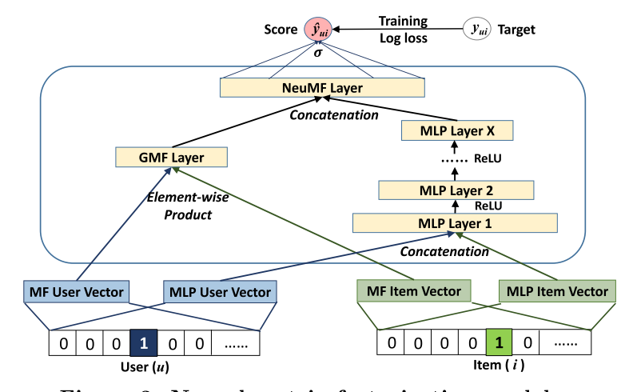
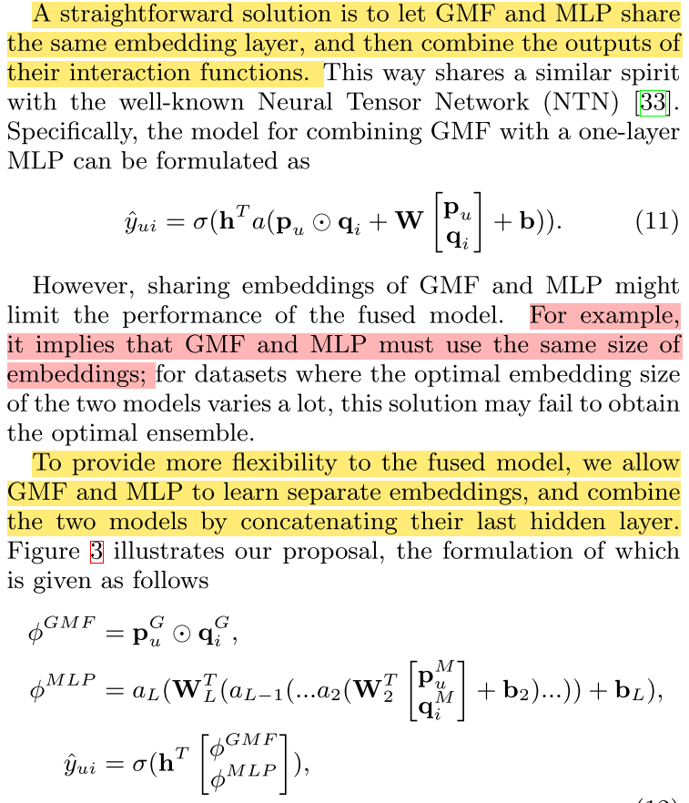

# 推荐系统之NeuralCF
## 模型框架
Neural CF模型是从传统的协同过滤方法(MF)的基础上进行的改进， 把MF里面用户向量和物品向量的点积操作换成了多层的神经网络， 使得两个向量可以做更充分的交叉， 得到更多有价值的特征组合信息， 另外一个就是神经网络的激活函数可以引入更多的非线性， 让模型的表达能力更强。  


## GMF和MLP如何融合？




```python
import torch
import torch.nn as nn
import torch.nn.functional as F 
from torchkeras import summary, Model
```

## 模型代码
注意：EMbedding的建立。


```python
class NeuralMF(nn.Module):
    
    def __init__(self, num_users, num_items, mf_dim, layers):
        super(NeuralMF, self).__init__()
        
        self.MF_Embedding_User = nn.Embedding(num_embeddings=num_users, embedding_dim=mf_dim)
        self.MF_Embedding_Item = nn.Embedding(num_embeddings=num_items, embedding_dim=mf_dim)
        
        self.MLP_Embedding_User = nn.Embedding(num_embeddings=num_users, embedding_dim=layers[0] // 2)
        self.MLP_Embedding_Item = nn.Embedding(num_embeddings=num_items, embedding_dim=layers[0] // 2)
        
        # 全连接网络
        self.dnn_network = nn.ModuleList([nn.Linear(layer[0], layer[1]) for layer in list(zip(layers[:-1], layers[1:]))])
        self.linear = nn.Linear(layers[-1], mf_dim)
        
        # 合并之后
        self.linear2 = nn.Linear(2*mf_dim, 1)
        self.sigmoid = nn.Sigmoid()
    
    def forward(self, inputs):
        # 这个inputs是一个批次的数据， 所以后面的操作切记写成inputs[0], [1]这种， 这是针对某个样本了， 我们都是对列进行的操作
        
        # 先把输入转成long类型
        inputs = inputs.long()
        
        # MF模型的计算 用户和物品的embedding
        MF_Embedding_User = self.MF_Embedding_User(inputs[:, 0])  # 这里踩了个坑， 千万不要写成[0]， 我们这里是第一列
        MF_Embedding_Item = self.MF_Embedding_Item(inputs[:, 1])
        # 两个向量点积过一个全连接
        mf_vec = torch.mul(MF_Embedding_User, MF_Embedding_Item)
        
        # MLP 模型的计算
        MLP_Embedding_User = self.MLP_Embedding_User(inputs[:, 0])  
        MLP_Embedding_Item = self.MLP_Embedding_Item(inputs[:, 1])
        # 两个隐向量堆叠起来
        x = torch.cat([MF_Embedding_User, MF_Embedding_Item], dim=-1)
        # l全连接网络
        for linear in self.dnn_network:
            x = linear(x)
            x = F.relu(x)
        mlp_vec = self.linear(x)
        
        # 合并两个
        #mf_vector = Lambda(lambda x: x * alpha)(mf_vector)
        #mlp_vector = Lambda(lambda x : x * (1-alpha))(mlp_vector)
        vector = torch.cat([mf_vec, mlp_vec], dim=-1)
        
        # liner
        linear = self.linear2(vector)
        output = self.sigmoid(linear)
        
        return output
```


```python
# 看一下这个网络
model = NeuralMF(1, 1, 10, [20, 64, 32, 16])
summary(model, input_shape=(2,))
```

    ----------------------------------------------------------------
            Layer (type)               Output Shape         Param #
    ================================================================
             Embedding-1                   [-1, 10]              10
             Embedding-2                   [-1, 10]              10
             Embedding-3                   [-1, 10]              10
             Embedding-4                   [-1, 10]              10
                Linear-5                   [-1, 64]           1,344
                Linear-6                   [-1, 32]           2,080
                Linear-7                   [-1, 16]             528
                Linear-8                   [-1, 10]             170
                Linear-9                    [-1, 1]              21
              Sigmoid-10                    [-1, 1]               0
    ================================================================
    Total params: 4,183
    Trainable params: 4,183
    Non-trainable params: 0
    ----------------------------------------------------------------
    Input size (MB): 0.000008
    Forward/backward pass size (MB): 0.001251
    Params size (MB): 0.015957
    Estimated Total Size (MB): 0.017216
    ----------------------------------------------------------------


# 参考

[AI上推荐 之 NeuralCF与PNN模型(改变特征交叉方式）](https://blog.csdn.net/wuzhongqiang/article/details/108985457)
