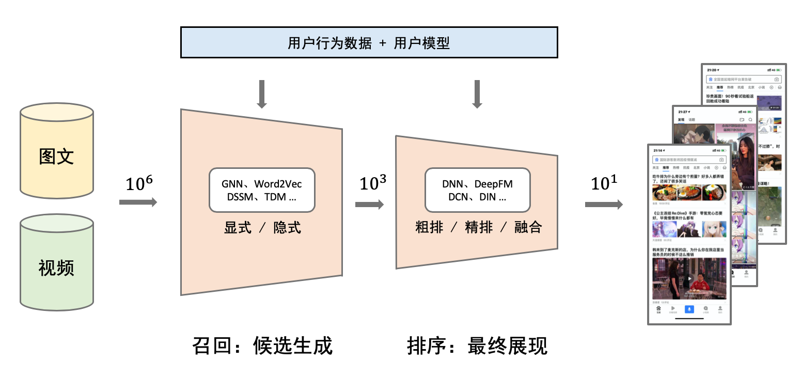

# 深度学习推荐系统

> 学习并整理一些经典的推荐系统算法

## 召回阶段

**目标**：主要根据用户部分特征，从海量的物品库里，快速找回一小部分用户潜在感兴趣的物品，然后交给排序环节，

### Embedding模型之Word2vec

论文地址：[word2vec Parameter Learning Explained](https://arxiv.org/abs/1411.2738)

### Embedding模型之DeepWalk
论文地址：[DeepWalk: Online Learning of Social Representations](https://arxiv.org/abs/1403.6652)

### Embedding模型之LINE

论文地址：[LINE: Large-scale Information Network Embedding](https://arxiv.org/abs/1503.03578)

### Embedding模型之Node2vec

论文地址：[node2vec: Scalable Feature Learning for Networks](https://sci-hub.ren/https://dl.acm.org/doi/abs/10.1145/2939672.2939754)

### Embedding模型之EGES

论文地址：[Billion-scale Commodity Embedding for E-commerce Recommendation in Alibaba](https://dl.acm.org/doi/abs/10.1145/3219819.3219869)

### Embedding模型之YoutubeDNN

论文地址：[Deep Neural Networks for YouTube Recommendations](https://static.googleusercontent.com/media/research.google.com/en//pubs/archive/45530.pdf)

## 粗排阶段

### 粗排模型之DNN 双塔

论文地址：[Sampling-bias-corrected neural modeling for large corpus item recommendations](https://dl.acm.org/doi/10.1145/3298689.3346996)

## 精排阶段-单目标

**目标**：精排环节可以融入较多特征，使用复杂模型，来精准地做个性化推荐。

### 精排模型之CF

论文地址：[Collaborative Filtering Recommender Systems](https://sci-hub.ren/https://link.springer.com/chapter/10.1007/978-3-540-72079-9_9)

### 精排模型之MF

论文地址：[Matrix Factorization Techniques For Recommender Systems](https://sci-hub.ren/https://ieeexplore.ieee.org/abstract/document/5197422/)

### 精排模型之FM

论文地址：[Factorization Machines](https://ieeexplore.ieee.org/document/5694074)

### 精排模型之GBDT+LR

论文地址：[Practical Lessons from Predicting Clicks on Ads at Facebook](https://dl.acm.org/doi/abs/10.1145/2648584.2648589)

### 精排模型之AutoRec

论文地址：[AutoRec: Autoencoders Meet Collaborative Filtering](https://dl.acm.org/doi/abs/10.1145/2740908.2742726)

### 精排模型之Deep&Cross

论文地址：[Deep & Cross Network for Ad Click Predictions](https://arxiv.org/abs/1708.05123)

### 精排模型之NeuralCF

论文地址：[Neural Collaborative Filtering](https://arxiv.org/abs/1708.05031)

### 精排模型之PNN

论文地址：[Product-based Neural Networks for User Response Prediction](https://arxiv.org/abs/1611.00144)

### 精排模型之Wide&Deep

论文地址：[Wide & Deep Learning for Recommender Systems](https://arxiv.org/abs/1606.07792)

### 精排模型之DeepFM

论文地址：[DeepFM: A Factorization-Machine based Neural Network for CTR Prediction](https://arxiv.org/abs/1703.04247)

官方代码：[DeepFM](https://github.com/xue-pai/FuxiCTR)

### 精排模型之XDeepFM

论文地址：[xDeepFM: Combining Explicit and Implicit Feature Interactions for Recommender Systems](https://arxiv.org/abs/1803.05170)

官方代码：[xDeepFM](https://github.com/Leavingseason/xDeepFM)

### 精排模型之DIN

论文地址：[Deep Interest Network for Click-Through Rate Prediction](https://arxiv.org/abs/1706.06978)

### 精排模型之DIEN

论文地址：[Deep Interest Evolution Network for Click-Through Rate Prediction](https://arxiv.org/abs/1809.03672)

## 精排阶段-多目标

**目标**：<u>多目标排序通常是指有**两个或两个以上**的目标函数，目的是寻求一种排序使得所有的目标函数都达到最优或满意。</u> 在工业界推荐系统中，大多是基于隐式反馈来进行推荐的，用户对推荐结果的满意度通常依赖很多指标（比如，淘宝基于点击，浏览深度（停留时间），加购，收藏，购买，重复购买，好评等行为的相关指标），在不同的推荐系统、不同时期、不同的产品形态下，这些指标的重要程度或者所代表的意义也会有所不同，如何优化最终推荐列表的顺序来使得众多指标在不同的场景下近可能达到最优或者满意，这就是一个多目标排序问题。

### 多目标模型之SharedBottom

论文地址：[An Overview of Multi-Task Learning in Deep Neural Networks](https://arxiv.org/abs/1706.05098)

### 多目标模型之ESMM

论文地址：[Entire Space Multi-Task Model: An Effective Approach for
Estimating Post-Click Conversion Rate](https://sci-hub.ren/https://dl.acm.org/doi/abs/10.1145/3209978.3210104)

### 多目标模型之MMoE

论文地址：[Modeling Task Relationships in Multi-task Learning with Multi-gate Mixture-of-Experts](https://dl.acm.org/doi/abs/10.1145/3219819.3220007)

### 多目标之模型之Youtube

论文地址：[Recommending what video to watch next: a multitask ranking system](https://dl.acm.org/doi/10.1145/3298689.3346997)

### 多目标模型之PLE

论文地址：[Progressive Layered Extraction (PLE): A Novel Multi-Task Learning (MTL) Model for Personalized Recommendations](https://dl.acm.org/doi/abs/10.1145/3383313.3412236)

## 重排阶段

待更新......

## 相关资料
[DeepCTR](https://github.com/shenweichen/DeepCTR)

[PaddleRec](https://github.com/PaddlePaddle/PaddleRec)

[DeepCTR-Torch](https://github.com/shenweichen/DeepCTR-Torch)

[推荐系统技术文章合集](https://github.com/cbamls/AI_Tutorial)

[从零开始了解推荐系统全貌](https://zhuanlan.zhihu.com/p/259985388)

[推荐系统技术演进趋势：从召回到排序再到重排](https://lumingdong.cn/technology-evolution-trend-of-recommendation-system.html)

[SENet双塔模型：在推荐领域召回粗排的应用及其它](https://mp.weixin.qq.com/s?__biz=Mzg4MzU1NjQ2Mw==&mid=2247499947&idx=1&sn=4bc119010b42a525b6ee3f4ea7cae0d3&chksm=cf4729abf830a0bd49635d552a5cb79e1419ac8edfc43f9d75113701c2426a91341eec2e4d75&scene=21#wechat_redirect)

