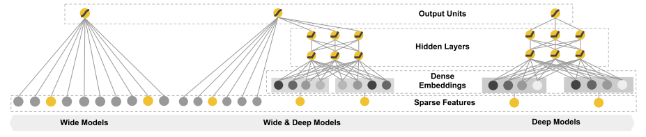

# 推荐系统之Wide&Deep

# 前言

"推荐" 对于我们来说并不陌生，已经渗透到了我们生活中的方方面面，比如淘宝的商品推荐，网易云的音乐推荐，抖音的短视频推荐等。在房产O2O领域，同样也需要推荐。无论在哪个推荐领域，推荐系统面临的一个共同挑战是如何同时满足推荐结果的准确性和多样性。<font color = "red">准确性要求推荐的内容与用户高度相关，推的精准；多样性则要求推荐内容更加新颖，让用户具有新鲜感。</font>


# 模型
Wide&Deep模型旨在使得训练得到的模型能够同时兼顾记忆（Memorization）与泛化（Generalization）能力：
- Memorization：模型能够从历史数据中学习到高频共现的特征组合，发掘特征之间的相关性，通过特征交叉产生特征相互作用的“记忆”，高效可解释。但要泛化，则需要更多的特征工程。
- Generalization：代表模型能够利用相关性的传递性去探索历史数据中从未出现过的特征组合，通过embedding的方法，使用低维稠密特征输入，可以更好的泛化训练样本中从未出现的交叉特征。


## Wide Part
记忆能力： 模型直接学习并利用（exploiting）历史数据中物品或特征“贡献频率”的能力。


```python
class Linear(nn.Module):
    """
    记忆能力
    """
    
    def __init__(self, input_dim):
        
        super(Linear, self).__init__()
        self.linear = nn.Linear(in_features=input_dim, out_features=1)
        
    def forward(self, x):
        
        x = self.linear(x)
        
        return x
```

## Deep Part
泛化能力： 基于特征传递的相关性，探索（exploring）过去从未或很少发生的新特征组合。


```python
class DNN(nn.Module):
    """
    泛化能力
    """
    
    def __init__(self, hidden_units, dropout = 0):
        
        super(DNN, self).__init__()
        
        self.dnn = nn.ModuleList([nn.Linear(layer[0], layer[1]) for layer in list(zip(hidden_units[:-1], hidden_units[1:]))])
        self.dropout = nn.Dropout(p = dropout)
        
    def forward(self, x):
        
        for linear in self.dnn:
            x = linear(x)
            x = F.relu(x)
        x = self.dropout(x)
        
        return x
```

## Wide&Deep
==注意==:交差积变换需要人工根据业务来构建合适的特征组合形式，输入线性部分(Wide part)的特征集为：原始特征和交叉积变换后的特征，dnn部分为全量的特征数据（离散特征:Embedding，稠密特征:归一化）。  


```python
class WideDeep(nn.Module):
    
    
    def __init__(self, feature_columns, hidden_units, dropout=0.):
        
        super(WideDeep, self).__init__()
        self.dense_feature, self.spase_feature = feature_columns
        # 编码Embedding
        self.embed_layer = nn.ModuleDict({
            "embed_" + str(i): nn.Embedding(num_embeddings=feat["feat_num"], embedding_dim=feat["embed_dim"]
                                           ) for i, feat in enumerate(self.spase_feature)})
        # dnn自适应输入大小
        hidden_units.insert(0, len(self.dense_feature) + len(self.spase_feature)*self.spase_feature[0]["embed_dim"])
        self.dnn_network = DNN(hidden_units, dropout)
        self.linear_layer = Linear(len(self.dense_feature))
        self.final_linear = nn.Linear(hidden_units[-1], 1)
        
    def forward(self, x):
        
        dense_input, spase_input = x[:, :len(self.dense_feature)], x[:, len(self.dense_feature):]
        spase_input = spase_input.long()
        spase_embdes = [self.embed_layer["embed_" + str(i)](spase_input[:, i]) for i in range(spase_input.shape[1])]
        
        # 拼接所有的Embedding向量
        spase_embdes = torch.cat(spase_embdes, axis=-1)
        # Embedding向量拼接稀疏特征(dnn端输入全量的特征数据)
        dnn_input = torch.cat([spase_embdes, dense_input], axis=-1)
        
        # wide
        wide_out = self.linear_layer(dense_input)
        
        # deep
        deep_out = self.dnn_network(dnn_input)
        deep_out = self.final_linear(deep_out)
        
        # 结合
        outputs = F.sigmoid(0.5*(wide_out + deep_out))
        
        return outputs
```


```python
hidden_units = [256, 128, 64]
hidden_units_copy = hidden_units.copy()
dnn_dropout = 0.

net = WideDeep(feat_info, hidden_units, dnn_dropout)
net
```


    WideDeep(
      (embed_layer): ModuleDict(
        (embed_0): Embedding(79, 8)
        (embed_1): Embedding(252, 8)
        (embed_2): Embedding(1293, 8)
        (embed_3): Embedding(1043, 8)
        (embed_4): Embedding(30, 8)
        (embed_5): Embedding(7, 8)
        (embed_6): Embedding(1164, 8)
        (embed_7): Embedding(39, 8)
        (embed_8): Embedding(2, 8)
        (embed_9): Embedding(908, 8)
        (embed_10): Embedding(926, 8)
        (embed_11): Embedding(1239, 8)
        (embed_12): Embedding(824, 8)
        (embed_13): Embedding(20, 8)
        (embed_14): Embedding(819, 8)
        (embed_15): Embedding(1159, 8)
        (embed_16): Embedding(9, 8)
        (embed_17): Embedding(534, 8)
        (embed_18): Embedding(201, 8)
        (embed_19): Embedding(4, 8)
        (embed_20): Embedding(1204, 8)
        (embed_21): Embedding(7, 8)
        (embed_22): Embedding(12, 8)
        (embed_23): Embedding(729, 8)
        (embed_24): Embedding(33, 8)
        (embed_25): Embedding(554, 8)
      )
      (dnn_network): DNN(
        (dnn): ModuleList(
          (0): Linear(in_features=221, out_features=256, bias=True)
          (1): Linear(in_features=256, out_features=128, bias=True)
          (2): Linear(in_features=128, out_features=64, bias=True)
        )
        (dropout): Dropout(p=0.0, inplace=False)
      )
      (linear_layer): Linear(
        (linear): Linear(in_features=13, out_features=1, bias=True)
      )
      (final_linear): Linear(in_features=64, out_features=1, bias=True)
    )

## 联合训练
**联合训练公式**：
$$
P(Y = 1| x) = \sigma(W_{wide}^{T}[x, \phi(x)] + W^T_{deep}a^{lf} +b)　\tag{１}
$$
其中, $\phi(x)$表示交叉积变换后的结果，如公式(2):
$$
\phi_k(x) = \sum^d_{i=1} x_i^{cki} cki\in{0, 1}\tag{２}
$$

**联合训练描述**：  


# 训练

## 参数设定


```python
# 模型的相关设置
def auc(y_pred, y_true):
    pred = y_pred.data
    y = y_true.data
    return roc_auc_score(y, pred)

loss_func = nn.BCELoss()
optimizer = torch.optim.Adam(params=net.parameters(), lr=0.0001)
metric_func = auc
metric_name = 'auc'

epochs = 6
log_step_freq = 10
```

## Training＆Validing


```python
dfhistory = pd.DataFrame(columns=["epoch", "loss", metric_name, "val_loss", "val_"+metric_name])
print('Start Training...')
nowtime = datetime.datetime.now().strftime("%Y-%m-%d %H:%M:%S")
print('========='*8 + "%s" %nowtime)

for epoch in tqdm(range(1, epochs+1)):
    # 训练阶段
    net.train()
    loss_sum = 0.0
    metric_sum = 0.0
    step = 1
    
    for step, (features, labels) in enumerate(train_dataloader, 1):
        labels = labels.unsqueeze(1)
        # 梯度清零
        optimizer.zero_grad()
        
        # 正向传播
        predictions = net(features)
        loss = loss_func(predictions, labels)
        try:          # 这里就是如果当前批次里面的y只有一个类别， 跳过去
            metric = metric_func(predictions, labels)
        except ValueError:
            pass
        
        # 反向传播求梯度
        loss.backward()
        optimizer.step()
        
        # 打印batch级别日志
        loss_sum += loss.item()
        metric_sum += metric.item()
        if step % log_step_freq == 0:
            print(("[step = %d] loss: %.3f, "+metric_name+": %.3f") %
                  (step, loss_sum/step, metric_sum/step))
    
    # 验证阶段
    net.eval()
    val_loss_sum = 0.0
    val_metric_sum = 0.0
    val_step = 1
    
    for val_step, (features, labels) in enumerate(val_dataloader, 1):
        labels = labels.unsqueeze(1)
        with torch.no_grad():
            predictions = net(features)
            val_loss = loss_func(predictions, labels)
            try:
                val_metric = metric_func(predictions, labels)
            except ValueError:
                pass
        val_loss_sum += val_loss.item()
        val_metric_sum += val_metric.item()
    
    # 记录日志
    info = (epoch, loss_sum/step, metric_sum/step, val_loss_sum/val_step, val_metric_sum/val_step)
    dfhistory.loc[epoch-1] = info
    
    # 打印epoch级别日志
    print(("\nEPOCH = %d, loss = %.3f,"+ metric_name + \
          "  = %.3f, val_loss = %.3f, "+"val_"+ metric_name+" = %.3f") 
          %info)
    nowtime = datetime.datetime.now().strftime('%Y-%m-%d %H:%M:%S')
    print("\n"+"=========="*8 + "%s"%nowtime)
        
print('Finished Training...')
```

# 模型评估


# 参考
[AI上推荐 之 Wide&Deep与Deep&Cross模型(记忆与泛化并存的华丽转身](https://blog.csdn.net/wuzhongqiang/article/details/109254498#t9)  
[见微知著，你真的搞懂Google的Wide&Deep模型了吗？](https://zhuanlan.zhihu.com/p/142958834)  
[wide&deep 在贝壳推荐场景的实践](https://mp.weixin.qq.com/s?__biz=MzI2ODA3NjcwMw==&mid=2247483659&idx=1&sn=deb9c5e22eabd3c52d2418150a40c68a&scene=21#wechat_redirect)  
[Wide&Deep模型的八个实战细节](https://www.zhuanzhi.ai/document/782d439e23f5751caded8d9e1e18dd16)  
[计算广告CTR预估系列(四)--Wide&Deep理论与实践](https://mp.weixin.qq.com/s?src=11&timestamp=1616937844&ver=2974&signature=cruWB0B-SfCJGo6xY2f9--asIvID6PoOzZbdCfdI7A5pLnjACvcD8cm6y**HYNer-IQioYhB*HzeIZ82jqlUWN5h-dNhSQPq4jqd3agIJf8KNQKy0tdY1tmOX9do28Dm&new=1)  
