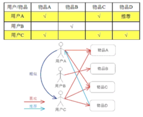

# 协同滤波算法

**原理**：所谓协同过滤， 基本思想是根据用户之前的喜好以及其他兴趣相近的用户的选择来给用户推荐物品(基于对用户历史行为数据的挖掘发现用户的喜好偏向， 并预测用户可能喜好的产品进行推荐)，一般是仅仅基于用户的行为数据（评价、购买、下载等）,<font color= "red"> 而不依赖于项的任何附加信息（物品自身特征）或者用户的任何附加信息（年龄， 性别等）</font>。  
**核心思想**：算法思想：<font color = "blue">物以类聚，人以群分</font>。  
实现协同过滤推荐有以下几个步骤：

1. **找出最相似的人或物品：TOP-N相似的人或物品**

   通过计算两两的相似度来进行排序，即可找出TOP-N相似的人或物品

2. **根据相似的人或物品产生推荐结果**

   利用TOP-N结果生成初始推荐结果，然后过滤掉用户已经有过记录的物品或明确表示不感兴趣的物品

## User-based CF（计算用户之间的相似度推荐）
目标：使其具有很强的社交特性，如新闻推荐。


### 构建数据


```python
users = ["User1", "User2", "User3", "User4", "User5"]
items = ["Item A", "Item B", "Item C", "Item D", "Item E"]
# 构建数据集
datasets = [
    ["buy",None,"buy","buy",None],
    ["buy",None,None,"buy","buy"],
    ["buy",None,"buy",None,None],
    [None,"buy",None,"buy","buy"],
    ["buy","buy","buy",None,"buy"],
]
```


```python
users = ["User1", "User2", "User3", "User4", "User5"]  
items = ["Item A", "Item B", "Item C", "Item D", "Item E"]
# 用户购买记录数据集
datasets = [
    [1,0,1,1,0],
    [1,0,0,1,1],
    [1,0,1,0,0],
    [0,1,0,1,1],
    [1,1,1,0,1],
]
```


```python
df = pd.DataFrame(datasets,
                  columns=items,
                  index=users)
df
```

<table border="1" class="dataframe">
  <thead>
    <tr style="text-align: right;">
      <th></th>
      <th>Item A</th>
      <th>Item B</th>
      <th>Item C</th>
      <th>Item D</th>
      <th>Item E</th>
    </tr>
  </thead>
  <tbody>
    <tr>
      <th>User1</th>
      <td>1</td>
      <td>0</td>
      <td>1</td>
      <td>1</td>
      <td>0</td>
    </tr>
    <tr>
      <th>User2</th>
      <td>1</td>
      <td>0</td>
      <td>0</td>
      <td>1</td>
      <td>1</td>
    </tr>
    <tr>
      <th>User3</th>
      <td>1</td>
      <td>0</td>
      <td>1</td>
      <td>0</td>
      <td>0</td>
    </tr>
    <tr>
      <th>User4</th>
      <td>0</td>
      <td>1</td>
      <td>0</td>
      <td>1</td>
      <td>1</td>
    </tr>
    <tr>
      <th>User5</th>
      <td>1</td>
      <td>1</td>
      <td>1</td>
      <td>0</td>
      <td>1</td>
    </tr>
  </tbody>
</table>
### 计算余弦相似度


```python
user_sim_cos = pd.DataFrame(cosine_similarity(df.values), columns=users, index=users)
user_sim_cos
```

<table border="1" class="dataframe">
  <thead>
    <tr style="text-align: right;">
      <th></th>
      <th>User1</th>
      <th>User2</th>
      <th>User3</th>
      <th>User4</th>
      <th>User5</th>
    </tr>
  </thead>
  <tbody>
    <tr>
      <th>User1</th>
      <td>1.000000</td>
      <td>0.666667</td>
      <td>0.816497</td>
      <td>0.333333</td>
      <td>0.577350</td>
    </tr>
    <tr>
      <th>User2</th>
      <td>0.666667</td>
      <td>1.000000</td>
      <td>0.408248</td>
      <td>0.666667</td>
      <td>0.577350</td>
    </tr>
    <tr>
      <th>User3</th>
      <td>0.816497</td>
      <td>0.408248</td>
      <td>1.000000</td>
      <td>0.000000</td>
      <td>0.707107</td>
    </tr>
    <tr>
      <th>User4</th>
      <td>0.333333</td>
      <td>0.666667</td>
      <td>0.000000</td>
      <td>1.000000</td>
      <td>0.577350</td>
    </tr>
    <tr>
      <th>User5</th>
      <td>0.577350</td>
      <td>0.577350</td>
      <td>0.707107</td>
      <td>0.577350</td>
      <td>1.000000</td>
    </tr>
  </tbody>
</table>

```python
# 获取用户之间最相关的用户
topN_users = {}

for i in user_sim_cos.index:
    _df = user_sim_cos.loc[i].drop([i])  # 消除自身
    _df_sorted = _df.sort_values(ascending=False)  # 降序
    top2 = list(_df_sorted.index[:2])
    topN_users[i] = top2
```


```python
topN_users
```


    {'User1': ['User3', 'User2'],
     'User2': ['User1', 'User4'],
     'User3': ['User1', 'User5'],
     'User4': ['User2', 'User5'],
     'User5': ['User3', 'User1']}


```python
# 计算推荐（在候选推荐的物品中过滤已经用户已经购买过的物品）
re_results = {}

for user, simi_users in topN_users.items():
    re_result = set()
    for simi_user in simi_users:
        re_result = re_result.union(set(df.loc[simi_user].replace(0, np.nan).dropna().index)) # 相似用户的购买情况
        re_result -= set(df.loc[user].replace(0, np.nan).dropna().index)  # 消除已购买物品
        re_results[user] = re_result
```


```python
re_results
```


    {'User1': {'Item E'},
     'User2': {'Item B', 'Item C'},
     'User3': {'Item B', 'Item D', 'Item E'},
     'User4': {'Item A', 'Item C'},
     'User5': {'Item D'}}

### 计算杰卡德相似系数


```python
#　score=交集/并集
jaccard_score(df["Item A"], df["Item B"])
```


    0.2


```python
# 用户相似度矩阵
use_similarity = 1 - pairwise_distances(df.values, metric="jaccard")
use_similarity = pd.DataFrame(use_similarity, columns=users, index=users)
use_similarity
```

<table border="1" class="dataframe">
  <thead>
    <tr style="text-align: right;">
      <th></th>
      <th>User1</th>
      <th>User2</th>
      <th>User3</th>
      <th>User4</th>
      <th>User5</th>
    </tr>
  </thead>
  <tbody>
    <tr>
      <th>User1</th>
      <td>1.000000</td>
      <td>0.50</td>
      <td>0.666667</td>
      <td>0.2</td>
      <td>0.4</td>
    </tr>
    <tr>
      <th>User2</th>
      <td>0.500000</td>
      <td>1.00</td>
      <td>0.250000</td>
      <td>0.5</td>
      <td>0.4</td>
    </tr>
    <tr>
      <th>User3</th>
      <td>0.666667</td>
      <td>0.25</td>
      <td>1.000000</td>
      <td>0.0</td>
      <td>0.5</td>
    </tr>
    <tr>
      <th>User4</th>
      <td>0.200000</td>
      <td>0.50</td>
      <td>0.000000</td>
      <td>1.0</td>
      <td>0.4</td>
    </tr>
    <tr>
      <th>User5</th>
      <td>0.400000</td>
      <td>0.40</td>
      <td>0.500000</td>
      <td>0.4</td>
      <td>1.0</td>
    </tr>
  </tbody>
</table>

```python
# 获取用户之间最相关的用户
topN_users = {}

for i in use_similarity.index:
    _df = use_similarity.loc[i].drop([i])
    _df_sorted = _df.sort_values(ascending=False)  # 降序
    top2 = list(_df_sorted.index[:2])
    topN_users[i] = top2
```


```python
# 得到相关度N的用户(rank)
topN_users
```


    {'User1': ['User3', 'User2'],
     'User2': ['User1', 'User4'],
     'User3': ['User1', 'User5'],
     'User4': ['User2', 'User5'],
     'User5': ['User3', 'User1']}


```python
# 计算推荐（在候选推荐的物品中过滤已经用户已经购买过的物品）
re_results = {}

for user, simi_users in topN_users.items():
    re_result = set()
    for simi_user in simi_users:
        re_result = re_result.union(set(df.loc[simi_user].replace(0, np.nan).dropna().index)) # 相似用户的购买情况
        re_result -= set(df.loc[user].replace(0, np.nan).dropna().index)  # 消除已购买物品
        re_results[user] = re_result
```


```python
# 推荐商品
re_results
```


    {'User1': {'Item E'},
     'User2': {'Item B', 'Item C'},
     'User3': {'Item B', 'Item D', 'Item E'},
     'User4': {'Item A', 'Item C'},
     'User5': {'Item D'}}

## Item-based CF（计算商品之间的相似度推荐）
目标：更适用于兴趣变化比较稳定的应用。如电商推荐、视频推荐。


```python
item_similarity = 1 - pairwise_distances(df.T.values, metric="jaccard")
item_similarity = pd.DataFrame(item_similarity, columns=items, index=items)
item_similarity
```

<table border="1" class="dataframe">
  <thead>
    <tr style="text-align: right;">
      <th></th>
      <th>Item A</th>
      <th>Item B</th>
      <th>Item C</th>
      <th>Item D</th>
      <th>Item E</th>
    </tr>
  </thead>
  <tbody>
    <tr>
      <th>Item A</th>
      <td>1.00</td>
      <td>0.200000</td>
      <td>0.75</td>
      <td>0.40</td>
      <td>0.400000</td>
    </tr>
    <tr>
      <th>Item B</th>
      <td>0.20</td>
      <td>1.000000</td>
      <td>0.25</td>
      <td>0.25</td>
      <td>0.666667</td>
    </tr>
    <tr>
      <th>Item C</th>
      <td>0.75</td>
      <td>0.250000</td>
      <td>1.00</td>
      <td>0.20</td>
      <td>0.200000</td>
    </tr>
    <tr>
      <th>Item D</th>
      <td>0.40</td>
      <td>0.250000</td>
      <td>0.20</td>
      <td>1.00</td>
      <td>0.500000</td>
    </tr>
    <tr>
      <th>Item E</th>
      <td>0.40</td>
      <td>0.666667</td>
      <td>0.20</td>
      <td>0.50</td>
      <td>1.000000</td>
    </tr>
  </tbody>
</table>

```python
# 商品之间
topN_items = {}

for i in item_similarity.index:
    _df = item_similarity.loc[i].drop([i])
    _df_sorted = _df.sort_values(ascending=False)  # 降序
    top2 = list(_df_sorted.index[:2])
    topN_items[i] = top2
```


```python
# Item rank
topN_items
```


    {'Item A': ['Item C', 'Item D'],
     'Item B': ['Item E', 'Item C'],
     'Item C': ['Item A', 'Item B'],
     'Item D': ['Item E', 'Item A'],
     'Item E': ['Item B', 'Item D']}


```python
# 计算推荐物品
re_results = {}

for user in df.index:
    re_result = set()
    
    for item in df.loc[user].replace(0, np.nan).dropna().index: # 每一个用户的购物情况
        re_result = re_result.union(topN_items[item])
        
    re_result -= set(df.loc[user].replace(0, np.nan).dropna().index)  #　消除已购买的
    re_results[user] = re_result
```


```python
# 推荐商品
re_results
```


    {'User1': {'Item B', 'Item E'},
     'User2': {'Item B', 'Item C'},
     'User3': {'Item B', 'Item D'},
     'User4': {'Item A', 'Item C'},
     'User5': {'Item D'}}

## 两种算法的预测

|  |  |
| :-------------------------------: | :-------------------------------: |
|              User-CF              |              Item=CF              |


```python
#　构造数据
users = ["User1", "User2", "User3", "User4", "User5"]
items = ["Item A", "Item B", "Item C", "Item D", "Item E"]
# 用户购买记录数据集
datasets = [
    [5,3,4,4,None],
    [3,1,2,3,3],
    [4,3,4,3,5],
    [3,3,1,5,4],
    [1,5,5,2,1],
]
```


```python
# 目标：预测用户1对商品Ｅ的打分情况
df = pd.DataFrame(datasets, columns=items, index=users)
df.head()
```

<table border="1" class="dataframe">
  <thead>
    <tr style="text-align: right;">
      <th></th>
      <th>Item A</th>
      <th>Item B</th>
      <th>Item C</th>
      <th>Item D</th>
      <th>Item E</th>
    </tr>
  </thead>
  <tbody>
    <tr>
      <th>User1</th>
      <td>5</td>
      <td>3</td>
      <td>4</td>
      <td>4</td>
      <td>NaN</td>
    </tr>
    <tr>
      <th>User2</th>
      <td>3</td>
      <td>1</td>
      <td>2</td>
      <td>3</td>
      <td>3.0</td>
    </tr>
    <tr>
      <th>User3</th>
      <td>4</td>
      <td>3</td>
      <td>4</td>
      <td>3</td>
      <td>5.0</td>
    </tr>
    <tr>
      <th>User4</th>
      <td>3</td>
      <td>3</td>
      <td>1</td>
      <td>5</td>
      <td>4.0</td>
    </tr>
    <tr>
      <th>User5</th>
      <td>1</td>
      <td>5</td>
      <td>5</td>
      <td>2</td>
      <td>1.0</td>
    </tr>
  </tbody>
</table>

```python
# 用户相似度
user_similar = df.T.corr()  # 默认皮尔逊相关系数
user_similar
```

<table border="1" class="dataframe">
  <thead>
    <tr style="text-align: right;">
      <th></th>
      <th>User1</th>
      <th>User2</th>
      <th>User3</th>
      <th>User4</th>
      <th>User5</th>
    </tr>
  </thead>
  <tbody>
    <tr>
      <th>User1</th>
      <td>1.000000</td>
      <td>0.852803</td>
      <td>0.707107</td>
      <td>0.000000</td>
      <td>-0.792118</td>
    </tr>
    <tr>
      <th>User2</th>
      <td>0.852803</td>
      <td>1.000000</td>
      <td>0.467707</td>
      <td>0.489956</td>
      <td>-0.900149</td>
    </tr>
    <tr>
      <th>User3</th>
      <td>0.707107</td>
      <td>0.467707</td>
      <td>1.000000</td>
      <td>-0.161165</td>
      <td>-0.466569</td>
    </tr>
    <tr>
      <th>User4</th>
      <td>0.000000</td>
      <td>0.489956</td>
      <td>-0.161165</td>
      <td>1.000000</td>
      <td>-0.641503</td>
    </tr>
    <tr>
      <th>User5</th>
      <td>-0.792118</td>
      <td>-0.900149</td>
      <td>-0.466569</td>
      <td>-0.641503</td>
      <td>1.000000</td>
    </tr>
  </tbody>
</table>

```python
# 商品相似度
item_similar = df.corr()
item_similar
```

<table border="1" class="dataframe">
  <thead>
    <tr style="text-align: right;">
      <th></th>
      <th>Item A</th>
      <th>Item B</th>
      <th>Item C</th>
      <th>Item D</th>
      <th>Item E</th>
    </tr>
  </thead>
  <tbody>
    <tr>
      <th>Item A</th>
      <td>1.000000</td>
      <td>-0.476731</td>
      <td>-0.123091</td>
      <td>0.532181</td>
      <td>0.969458</td>
    </tr>
    <tr>
      <th>Item B</th>
      <td>-0.476731</td>
      <td>1.000000</td>
      <td>0.645497</td>
      <td>-0.310087</td>
      <td>-0.478091</td>
    </tr>
    <tr>
      <th>Item C</th>
      <td>-0.123091</td>
      <td>0.645497</td>
      <td>1.000000</td>
      <td>-0.720577</td>
      <td>-0.427618</td>
    </tr>
    <tr>
      <th>Item D</th>
      <td>0.532181</td>
      <td>-0.310087</td>
      <td>-0.720577</td>
      <td>1.000000</td>
      <td>0.581675</td>
    </tr>
    <tr>
      <th>Item E</th>
      <td>0.969458</td>
      <td>-0.478091</td>
      <td>-0.427618</td>
      <td>0.581675</td>
      <td>1.000000</td>
    </tr>
  </tbody>
</table>
基于用户的预测:
$$
pred(u,i)=\hat{r}_{ui}=\cfrac{\sum_{v\in U}sim(u,v)*r_{vi}}{\sum_{v\in U}|sim(u,v)|}
$$


```python
top2 = user_similar["User1"].sort_values(axis=0, ascending=False).drop(["User1"])[:2]
top2
```


    User2    0.852803
    User3    0.707107
    Name: User1, dtype: float64


```python
rank = df.loc[top2.index, "Item E"]
rank
```


    User2    3.0
    User3    5.0
    Name: Item E, dtype: float64


```python
predict = (top2.values*rank.values).sum()/top2.values.sum()
round(predict, 2)
```


    3.91

基于商品的预测:
$$
 pred(u,i)=\hat{r}_{ui}=\cfrac{\sum_{j\in I_{rated}}sim(i,j)*r_{uj}}{\sum_{j\in I_{rated}}sim(i,j)}
$$


```python
top2 = item_similar["Item E"].sort_values(ascending=False).drop(["Item E"])[:2]
top2
```


    Item A    0.969458
    Item D    0.581675
    Name: Item E, dtype: float64


```python
rank = df.loc["User1", top2.index]
rank
```


    Item A    5.0
    Item D    4.0
    Name: User1, dtype: float64


```python
predict = (top2*rank).sum()/top2.sum()
round(predict, 2)
```


    4.62

# 案例：基于协同滤波的电影推荐

## 数据加载
构建用户评分矩阵


```python
def load_data(data_path):
    """加载数据"""
    
    cache_path = os.path.join(CACHE_DIR,"rating_matric.cache")
    print("开始加载数据集")
    
    if os.path.exists(cache_path):
        print("加载缓存中")
        rating_matrix = pd.read_pickle(cache_path)
        print("缓存加载完毕")
    else:
        print("加载新数据")
        dtype = {"userId":np.int32, "movieId":np.int32, "rating":np.float32}
        df = pd.read_csv("data/ratings.csv", dtype=dtype, usecols=range(3))
        rating_matrix = df.pivot_table(index=["userId"], columns="movieId", values="rating")
        rating_matrix.to_pickle(cache_path)
        print("新数据加载完毕")
        
    return rating_matrix
```

## 计算相似度
用户相似度和物品相似度


```python
def compute_person_similarity(rating_matrix, based="user"):
    """计算相似度"""
    
    user_similarity_cache_path = os.path.join(CACHE_DIR, "user_similarity.cache")
    item_similarity_cache_path = os.path.join(CACHE_DIR, "item_similarity.cache")
    
    if based == "user":
        if os.path.exists(user_similarity_cache_path):
            print("缓存中获取用户相似度")
            similarity = pd.read_pickle(user_similarity_cache_path)
        else:
            print("正在计算用户相似度")
            similarity = rating_matrix.T.corr()
            similarity.to_pickle(user_similarity_cache_path)
    elif based == "item":
        if os.path.exists(item_similarity_cache_path):
            print("缓存中获取电影相似度")
            similarity = pd.read_pickle(item_similarity_cache_path)
        else:
            print("正在计算电影相似度")
            similarity = rating_matrix.corr()
            similarity.to_pickle(item_similarity_cache_path)
    else:
        raise Exception("Unhandles based value %s" % based)
    
    print("相似度计算完成")
    
    return similarity
```

## 评分预测

预测公式如下：
$$
R_{(u,p)} = \cfrac{\sum_{s\in{S}}(w_{u,s}*R_{s,p})}{\sum_{s\in{S}}*w_{u,s}}
$$

其中，权重$w_{u, s}$是用户u对用户s的相似度,$R_{s,p}$是用户s对物品p的评分。


```python
def predict(uid, iid, rating_matrix, user_similar):
    """预测给定用户对物品的评分值"""
    
#     print("开始预测用户<%d>对电影<%d>的评分"%(uid, iid))
    similar_user = user_similar[uid].drop(uid).dropna() #　提取相似用户消除空值
    similar_user = similar_user.where(similar_user>0).dropna()
    
    if similar_user.empty:
        raise Exception("用户<%d>无相似信息"%(uid))
    ids = set(similar_user.index)&set(rating_matrix[iid].dropna().index)
    # 最终与用户相似的n个用户
    finnaly_similar_users = similar_user.loc[list(ids)]
    
    sum_up = 0.0
    sum_down = 0.0
    
    # 遍历相似用户，并找出相似用户对推荐物品的评分，从而加权预测出相对应的推荐评分
    for sim_uid, similarity in finnaly_similar_users.iteritems():
        
        # 获取相应用户所对应的评分
        sim_user_rated_movied = rating_matrix.loc[sim_uid].dropna()
        similar_user_rating_for_item = sim_user_rated_movied.loc[iid]
        
        # 计算预测值(加权)
        sum_up += similarity * similar_user_rating_for_item
        sum_down += similarity
    
    score = sum_up/sum_down
    
#     print("预测结束，用户<%d>对<%d>的预测分数为：%0.2f"%(uid, iid, score))
    return round(score)
```

## 基于规则的过滤方式


```python
def _predict_all(item_ids, uid, rating_matrix, user_similar):
    
    for iid in item_ids:
        try:
            rating = predict(uid=1, iid=iid, rating_matrix=rating_matrix, user_similar=user_similar)
        except Exception as e:
            print(e)
        else:
            yield uid, iid, rating  # 产生可迭代的对象
```


```python
def predict_all(uid, rating_matrix, user_similar, filter_rule=None):
    """基于给定规则的过滤方式"""
    
    print("执行预测")
    if not filter_rule:
        item_ids = rating_matrix.columns
    elif isinstance(filter_rule, str) and filter_rule == "unhot":
        """过滤非热门电影"""
        count = rating_matrix.count()
        item_ids = count.where(count>10).dropna().index # 获取电影总评分大于十分的电影
    elif isinstance(filter_rule, str) and filter_rule == "rated":
        """过滤用户评分过的电影"""
        user_rating = rating_matrix.loc[uid].dropna()
        _ = user_rating<6
        item_ids = _.where(_==False).dropna().index
    elif isinstance(filter_rule, list) and set(filter_rule) == set(["unhot", "rated"]):
        """过滤非热门和用户已经评分过的电影"""
        
        # unhot
        count = rating_matrix.count()
        item_ids1 = count.where(count>10).dropna().index
        
        # rated
        user_rating = rating_matrix.loc[uid].dropna()
        _ = user_rating<6
        item_ids2 = _.where(_==False).dropna().index
        
        item_ids = set(item_ids1)&set(item_ids2)
    else:
        raise Exception("无效过滤参数")
    
    yield from _predict_all(item_ids, uid, rating_matrix, user_similar)
```


```python
def top_k_result(k):
    
    rating_matrix = load_data(DATA_PATH)
    user_similar = compute_person_similarity(rating_matrix)
    results = predict_all(1, rating_matrix, user_similar, filter_rule="unhot")
    
    return sorted(results, key=lambda x:x[2], reverse=True)[:k]
```


```python
top_k_result(2)
```

    开始加载数据集
    加载缓存中
    缓存加载完毕
    缓存中获取用户相似度
    相似度计算完成
    执行预测
    [(1, 280, 5), (1, 318, 5)]

# 总结

**User-CF**：由于是基于用户相似度进行推荐， 所以具备更强的社交特性， 这样的特点非常适于用户少， 物品多， 时效性较强的场合， 比如新闻推荐场景， 因为新闻本身兴趣点分散， 相比用户对不同新闻的兴趣偏好， 新闻的及时性，热点性往往更加重要， 所以正好适用于发现热点，跟踪热点的趋势。 另外还具有推荐新信息的能力， 更有可能发现惊喜, 因为看的是人与人的相似性, 推出来的结果可能更有惊喜，可以发现用户潜在但自己尚未察觉的兴趣爱好。  
**Item-CF**：这个更适用于兴趣变化较为稳定的应用， 更接近于个性化的推荐， 适合物品少，用户多，用户兴趣固定持久， 物品更新速度不是太快的场合， 比如推荐艺术品， 音乐， 电影。

# 参考

[如何理解皮尔逊相关系数（Pearson Correlation Coefficient）？](https://www.zhihu.com/question/19734616)  
[推荐系统组队学习之协同过滤](http://datawhale.club/t/topic/41)
