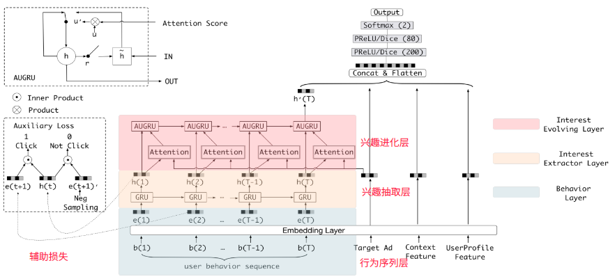
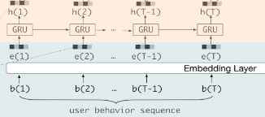
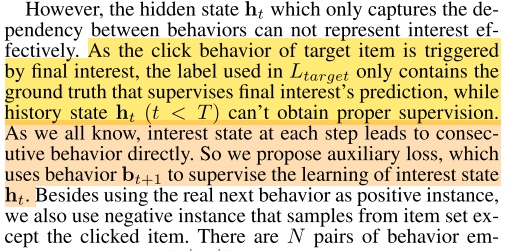
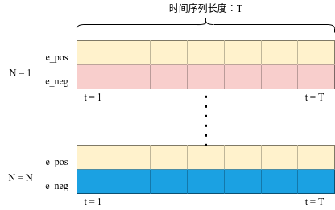
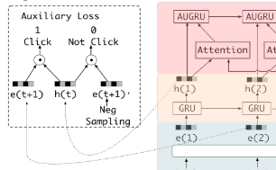
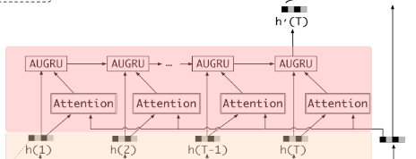
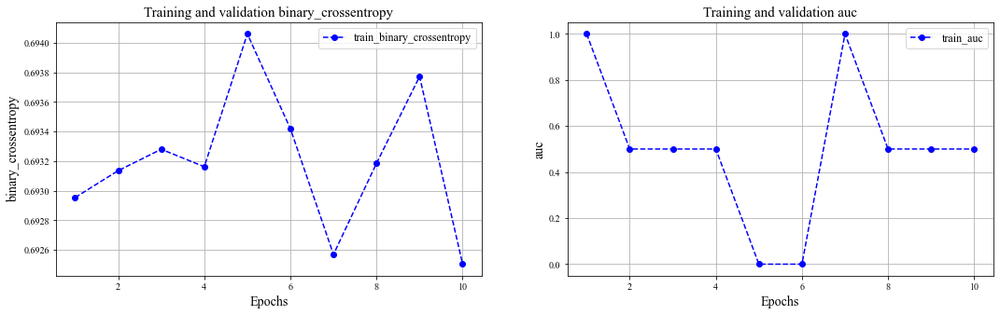
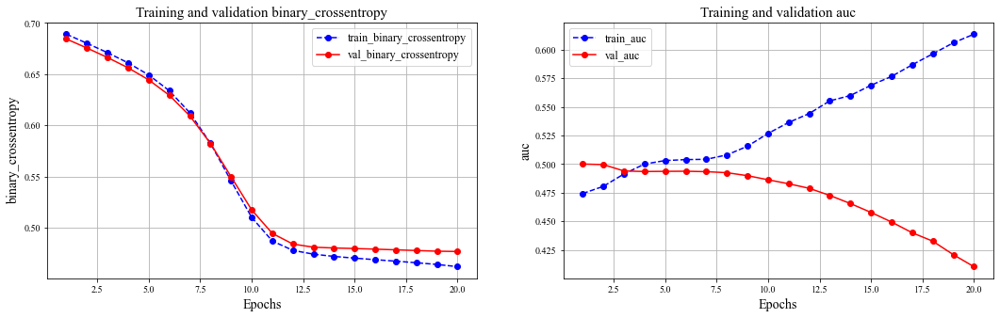

# 推荐系统之DIEN
> 主要贡献：  
• We focus on interest evolving phenomenon in e-commerce system, and propose a new structure of network to model interest evolving  process. The model for interest evolution leads to more expressive interest representation and more precise CTR prediction.  
• Different from taking behaviors as interests directly, we specially design interest extractor layer. Pointing at the problem that   hidden state of GRU is less targeted for interest representation, we propose one auxiliary loss. Auxiliary loss uses consecutive   behavior to supervise the learning of hidden state at each step. which makes hidden state expressive enough to represent latent  interest.  
• We design interest evolving layer novelly, where GPU with attentional update gate (AUGRU) strengthens the effect from relevant  interests to target item and overcomes the inference from interest drifting.  
问题导向：  
1.引入时间序列有什么好处？  
2.辅助损失函数的负样本怎么采集？  
> 3.辅助损失怎么计算？

## 模型架构
相对与DIN主要变化：引入了兴趣抽取层和兴趣进化层  
模型数据处理流程：  

**structure**: embedding layer -> interest extractor layer -> interest evolution layer -> DNN layer -> out  
- behavior layer:主要作用是把原始的id类行为序列转成Embedding行为序。  
- interest extractor layer：没有建立与推荐物品之间的用户兴趣演变。  
- interest evolution layer：加入与推荐物品有关的注意力联系，进化与候选商品有关的兴趣演变过程。  

**图示**:  



```python
class BaseModel:
    pass


class DIEN(BaseModel):
    """Instantiates the Deep Interest Evolution Network architecture.

    :param dnn_feature_columns: An iterable containing all the features used by deep part of the model.
    :param history_feature_list: list,to indicate  sequence sparse field
    :param gru_type: str,can be GRU AIGRU AUGRU AGRU
    :param use_negsampling: bool, whether or not use negtive sampling
    :param alpha: float ,weight of auxiliary_loss
    :param use_bn: bool. Whether use BatchNormalization before activation or not in deep net
    :param dnn_hidden_units: list,list of positive integer or empty list, the layer number and units in each layer of DNN
    :param dnn_activation: Activation function to use in DNN
    :param att_hidden_units: list,list of positive integer , the layer number and units in each layer of attention net
    :param att_activation: Activation function to use in attention net
    :param att_weight_normalization: bool.Whether normalize the attention score of local activation unit.
    :param l2_reg_dnn: float. L2 regularizer strength applied to DNN
    :param l2_reg_embedding: float. L2 regularizer strength applied to embedding vector
    :param dnn_dropout: float in [0,1), the probability we will drop out a given DNN coordinate.
    :param init_std: float,to use as the initialize std of embedding vector
    :param seed: integer ,to use as random seed.
    :param task: str, ``"binary"`` for  binary logloss or  ``"regression"`` for regression loss
    :param device: str, ``"cpu"`` or ``"cuda:0"``
    :param gpus: list of int or torch.device for multiple gpus. If None, run on `device`. `gpus[0]` should be the same gpu with `device`.
    :return: A PyTorch model instance.

    """

    def __init__(self,
                 dnn_feature_columns, history_feature_list,
                 gru_type="GRU", use_negsampling=False, alpha=1.0, use_bn=False, dnn_hidden_units=(256, 128),
                 dnn_activation='relu',
                 att_hidden_units=(64, 16), att_activation="relu", att_weight_normalization=True,
                 l2_reg_dnn=0, l2_reg_embedding=1e-6, dnn_dropout=0, init_std=0.0001, seed=1024, task='binary',
                 device='cpu', gpus=None):
        
        super(DIEN, self).__init__([], dnn_feature_columns, l2_reg_linear=0, l2_reg_embedding=l2_reg_embedding,
                                   init_std=init_std, seed=seed, task=task, device=device, gpus=gpus)

        self.item_features = history_feature_list
        self.use_negsampling = use_negsampling
        self.alpha = alpha
        self._split_columns()

        # structure: embedding layer -> interest extractor layer -> interest evolution layer -> DNN layer -> out

        # embedding layer
        # inherit -> self.embedding_dict
        input_size = self._compute_interest_dim()
        # interest extractor layer
        self.interest_extractor = InterestExtractor(input_size=input_size, use_neg=use_negsampling, init_std=init_std)
        # interest evolution layer
        self.interest_evolution = InterestEvolving(
            input_size=input_size,
            gru_type=gru_type,
            use_neg=use_negsampling,
            init_std=init_std,
            att_hidden_size=att_hidden_units,
            att_activation=att_activation,
            att_weight_normalization=att_weight_normalization)
        # DNN layer
        dnn_input_size = self._compute_dnn_dim() + input_size
        self.dnn = DNN(dnn_input_size, dnn_hidden_units, dnn_activation, l2_reg_dnn, dnn_dropout, use_bn,
                       init_std=init_std, seed=seed)
        self.linear = nn.Linear(dnn_hidden_units[-1], 1, bias=False)
        # prediction layer
        # inherit -> self.out

        # init
        for name, tensor in self.linear.named_parameters():
            if 'weight' in name:
                nn.init.normal_(tensor, mean=0, std=init_std)

        self.to(device)

    def forward(self, X):
        # [B, H] , [B, T, H], [B, T, H] , [B]
        query_emb, keys_emb, neg_keys_emb, keys_length = self._get_emb(X)
        # [b, T, H],  [1]  (b<H)
        # 只有用户行为序列
        masked_interest, aux_loss = self.interest_extractor(keys_emb, keys_length, neg_keys_emb)
        self.add_auxiliary_loss(aux_loss, self.alpha)
        # [B, H]
        # 加入与候选商品的关联性
        hist = self.interest_evolution(query_emb, masked_interest, keys_length)
        # [B, H2]
        deep_input_emb = self._get_deep_input_emb(X)
        deep_input_emb = concat_fun([hist, deep_input_emb])
        dense_value_list = get_dense_input(X, self.feature_index, self.dense_feature_columns)
        dnn_input = combined_dnn_input([deep_input_emb], dense_value_list)
        # [B, 1]
        output = self.linear(self.dnn(dnn_input))
        y_pred = self.out(output)
        return y_pred
```

## 兴趣抽取层
<font color = "red">主要作用</font>:模拟用户兴趣迁移的过程，抽取用户兴趣。

### GRU兴趣抽取层

<font color = "red">注意</font>：注意代码中Auxilary Loss输入的时间维度，隐藏层的h(t)要和下一次输入的正负Embedding向量相乘计算Loss，且会使得时间序列减少一个t。  
```python
aux_loss = self._cal_auxiliary_loss(  
    interests[:, :-1, :],  # 时间从头到为(ht, 1 <= t < T)  
    masked_keys[:, 1:, :],  #　下一个时刻输入的(e(t+1), 1 <= t < T)向量，正例  
    masked_neg_keys[:, 1:, :],  # 下一时刻输入的(e'(t+1), 1 <= t < T)向量，负例  
    masked_keys_length - 1
)
```



```python
class InterestExtractor(nn.Module):
    
    def __init__(self, input_size, use_neg=False, init_std=0.001, device='cpu'):
        
        super(InterestExtractor, self).__init__()
        
        self.use_neg = use_neg
        self.gru = nn.GRU(input_size=input_size, hidden_size=input_size, batch_first=True)
        
        if self.use_neg:
            self.auxiliary_net = DNN(input_size * 2, [100, 50, 1], 'sigmoid', init_std=init_std, device=device)
            
        for name, tensor in self.gru.named_parameters():
            if 'weight' in name:
                nn.init.normal_(tensor, mean=0, std=init_std)
                
        self.to(device)

    def forward(self, keys, keys_length, neg_keys=None):
        """
        Parameters
        ----------
        keys: 3D tensor, [B, T, H]，用户行为序列的的Embedding向量
        keys_length: 1D tensor, [B]，用户行为序列的长度
        neg_keys: 3D tensor, [B, T, H]，负采样的Embedding向量

        Returns
        -------
        masked_interests: 2D tensor, [b, H]
        aux_loss: [1]
        """
        batch_size, max_length, dim = keys.size()
        # [B, H]
        zero_outputs = torch.zeros(batch_size, dim, device=keys.device)
        aux_loss = torch.zeros((1,), device=keys.device)

        # create zero mask for keys_length, to make sure 'pack_padded_sequence' safe
        mask = keys_length > 0
        masked_keys_length = keys_length[mask]

        # batch_size validation check
        if masked_keys_length.shape[0] == 0:
            return zero_outputs,

        masked_keys = torch.masked_select(keys, mask.view(-1, 1, 1)).view(-1, max_length, dim)

        packed_keys = pack_padded_sequence(masked_keys, lengths=masked_keys_length, batch_first=True,
                                           enforce_sorted=False)
        # packed_intersts: [T, B, H]
        packed_interests, _ = self.gru(packed_keys)
        interests, _ = pad_packed_sequence(packed_interests, batch_first=True, padding_value=0.0,
                                           total_length=max_length)

        if self.use_neg and neg_keys is not None:
            masked_neg_keys = torch.masked_select(neg_keys, mask.view(-1, 1, 1)).view(-1, max_length, dim)
            # 注意auxloss的时间维度
            aux_loss = self._cal_auxiliary_loss(
                interests[:, :-1, :],  # 时间从头到为(h(t), 1 <= t < T)
                masked_keys[:, 1:, :],  #　下一个时刻输入的(e(t+1), 1 <= t < T)向量，正例
                masked_neg_keys[:, 1:, :],  # 下一时刻输入的(e'(t+1), 1 <= t < T)向量，负例
                masked_keys_length - 1
            )

        return interests, aux_loss
```

### 辅助损失计算
**目标**：   
就是让当前时刻输出的隐藏状态$h_t$尽量的与下一个时刻用户点击的行为embedding相似，与下一个时刻里面用户没有点击过的行为embedding越远。　　
- aux_loss引入说明  

- 损失函数(注意时间维度和输入维度)
$$
L_{aux} = -1/N(\sum^N_{i=1}\sum_{t}log\sigma(h^i_t, e^i_b[t+1]) + log(1 - \sigma(h^i_t, e^{i'}_b[t+1])))
$$
- N-Pairs(个人理解，与采样的负样本序列有关,负样本的采样不考虑当前时间结点的Embedding向量)  

- 图例  



```python
def _cal_auxiliary_loss(self, states, click_seq, noclick_seq, keys_length):

    # keys_length >= 1
    mask_shape = keys_length > 0
    keys_length = keys_length[mask_shape]
    if keys_length.shape[0] == 0:
        return torch.zeros((1,), device=states.device)

    _, max_seq_length, embedding_size = states.size()
    states = torch.masked_select(states, mask_shape.view(-1, 1, 1)).view(-1, max_seq_length, embedding_size)
    click_seq = torch.masked_select(click_seq, mask_shape.view(-1, 1, 1)).view(-1, max_seq_length, embedding_size)
    noclick_seq = torch.masked_select(noclick_seq, mask_shape.view(-1, 1, 1)).view(-1, max_seq_length,
                                                                                   embedding_size)
    batch_size = states.size()[0]

    mask = (torch.arange(max_seq_length, device=states.device).repeat(
        batch_size, 1) < keys_length.view(-1, 1)).float()

    click_input = torch.cat([states, click_seq], dim=-1)
    noclick_input = torch.cat([states, noclick_seq], dim=-1)
    embedding_size = embedding_size * 2

    # 下一次已点击
    click_p = self.auxiliary_net(click_input.view(
        batch_size * max_seq_length, embedding_size)).view(
        batch_size, max_seq_length)[mask > 0].view(-1, 1)  # [T, 1]
    click_target = torch.ones(
        click_p.size(), dtype=torch.float, device=click_p.device)

    # 下一次未点击
    noclick_p = self.auxiliary_net(noclick_input.view(
        batch_size * max_seq_length, embedding_size)).view(
        batch_size, max_seq_length)[mask > 0].view(-1, 1)  # [T, 1]
    noclick_target = torch.zeros(
        noclick_p.size(), dtype=torch.float, device=noclick_p.device)

    # 二元交叉熵损失
    loss = F.binary_cross_entropy(
        torch.cat([click_p, noclick_p], dim=0),
        torch.cat([click_target, noclick_target], dim=0))

    return loss
```


### aux-loss优点
总的来说，引入辅助损失具有以下几个优点:
- 从兴趣学习的角度来看，引入辅助损失可以使GRU的各个隐藏状态都能表达出兴趣。
- 对于GRU的优化，当GRU模型为长历史行为序列时，辅助损失降低了反向传播的难度。
- 辅助损失为嵌入层的学习提供了更多的语义信息，从而得到更好的嵌入矩阵。

## 兴趣进化层
<font color = "red">主要作用</font>：在兴趣抽取层的基础上加入注意力机制，模拟与当前目标广告相关的兴趣进化过程。

### AUGRU计算
**AUGRU优点**：既保留了AGRU的优点， 能够让与当前候选广告相关的兴趣合理演化而不受非相关兴趣的影响， 又克服了AGRU忽略了兴趣在不同维度上的保持重要性的不足，因为这个并没有改变更新门的向量维度，依然是向量，依然每个维度可以决定兴趣相应维度的重要性。 因此，AUGRU使得每一步的局部激活都能强化相关兴趣的作用，减弱兴趣漂移的干扰，有助于模拟相对目标项目的兴趣演化过程。
- 计算公式
$$
\begin{array}{l}
\tilde{\mathbf{u}}_{t}^{\prime}=a_{t} * \mathbf{u}_{t}^{\prime} \\
\mathbf{h}_{t}^{\prime}=\left(1-\tilde{\mathbf{u}}_{t}^{\prime}\right) \circ \mathbf{h}_{t-1}^{\prime}+\tilde{\mathbf{u}}_{t}^{\prime} \circ \tilde{\mathbf{h}}_{t}^{\prime}
\end{array}
$$
其中，$a_t$为相应时间序列的注意力权重分数，而$\tilde{\mathbf{u}}_{t}^{\prime}$为更新门，注意机制分数计算的过程与DIN模型一样，不过此处对最后的相关度进行了归一化操作SoftMax。
- 图例  



```python
class AUGRUCell(nn.Module):
    """ Effect of GRU with attentional update gate (AUGRU)

        Reference:
        -  Deep Interest Evolution Network for Click-Through Rate Prediction[J]. arXiv preprint arXiv:1809.03672, 2018.
    """

    def __init__(self, input_size, hidden_size, bias=True):
        super(AUGRUCell, self).__init__()
        self.input_size = input_size
        self.hidden_size = hidden_size
        self.bias = bias
        # (W_ir|W_iz|W_ih)
        self.weight_ih = nn.Parameter(torch.Tensor(3 * hidden_size, input_size))
        self.register_parameter('weight_ih', self.weight_ih)
        # (W_hr|W_hz|W_hh)
        self.weight_hh = nn.Parameter(torch.Tensor(3 * hidden_size, hidden_size))
        self.register_parameter('weight_hh', self.weight_hh)
        if bias:
            # (b_ir|b_iz|b_ih)
            self.bias_ih = nn.Parameter(torch.Tensor(3 * hidden_size))
            self.register_parameter('bias_ih', self.bias_ih)
            # (b_hr|b_hz|b_hh)
            self.bias_hh = nn.Parameter(torch.Tensor(3 * hidden_size))
            self.register_parameter('bias_ih', self.bias_hh)
            for tensor in [self.bias_ih, self.bias_hh]:
                nn.init.zeros_(tensor, )
        else:
            self.register_parameter('bias_ih', None)
            self.register_parameter('bias_hh', None)

    def forward(self, input, hx, att_score):
        
        gi = F.linear(input, self.weight_ih, self.bias_ih)
        gh = F.linear(hx, self.weight_hh, self.bias_hh)
        i_r, i_z, i_n = gi.chunk(3, 1)
        h_r, h_z, h_n = gh.chunk(3, 1)

        reset_gate = torch.sigmoid(i_r + h_r)
        update_gate = torch.sigmoid(i_z + h_z)
        new_state = torch.tanh(i_n + reset_gate * h_n)
        # 引入注意力机制，与候选商品建立练习
        att_score = att_score.view(-1, 1)
        # 重新设置更新门，引入注意力分数
        update_gate = att_score * update_gate
        hy = (1. - update_gate) * hx + update_gate * new_state
        
        return hy
```

## 实战1:DIEN模型初探


```python
from deepctr_torch.models import DIEN
from deepctr_torch.inputs import SparseFeat, DenseFeat, VarLenSparseFeat, get_feature_names
import numpy as np
import pandas as pd
import matplotlib.pyplot as plt
from random import sample
from matplotlib import rcParams
import warnings

warnings.filterwarnings("ignore")
config = {
    "font.family":'Times New Roman',  # 设置字体类型
}

rcParams.update(config)
```

### 数据预处理


```python
# 数据处理
behavior_feature_list = ["item_id", "cate_id"]
uid = np.array([0, 1, 2, 3])
gender = np.array([0, 1, 0, 1])
item_id = np.array([1, 2, 3, 2])  # 0 is mask value
cate_id = np.array([1, 2, 1, 2])  # 0 is mask value
score = np.array([0.1, 0.2, 0.3, 0.2])

hist_item_id = np.array([[1, 2, 3, 0], [1, 2, 3, 0], [1, 2, 0, 0], [1, 2, 0, 0]])
hist_cate_id = np.array([[1, 1, 2, 0], [2, 1, 1, 0], [2, 1, 0, 0], [1, 2, 0, 0]])
behavior_length = np.array([3, 3, 2, 2])

feature_dict = {'user': uid, 'gender': gender, 'item_id': item_id, 'cate_id': cate_id,
                'hist_item_id': hist_item_id, 'hist_cate_id': hist_cate_id,
                'pay_score': score, "seq_length": behavior_length}
```


```python
# 编码数据信息
# sigle_feat
feature_columns = [SparseFeat("user", 4, embedding_dim = 4)
                   , SparseFeat("gender", 2, embedding_dim = 2)
                   , SparseFeat("item_id", 3 + 1, embedding_dim = 8)
                   , SparseFeat("cate_id", 2 + 1, embedding_dim=4)
                   , DenseFeat("pay_score", 1)
                  ]
# hist_feat
feature_columns += [VarLenSparseFeat(SparseFeat("hist_item_id", vocabulary_size = 3 + 1, embedding_dim = 8, embedding_name = "item_id")
                                     , maxlen=4
                                     , length_name="seq_length"
                                    )
                    , VarLenSparseFeat(SparseFeat("hist_cate_id", vocabulary_size = 2 + 1, embedding_dim=4, embedding_name="cate_id")
                                       , maxlen=4
                                       , length_name="seq_length"
                                      )
                   ]
```


```python
# 负采样数据
# 采样数据？
feature_dict['neg_hist_item_id'] = np.array([[1, 2, 3, 0], [1, 2, 3, 0], [1, 2, 0, 0], [1, 2, 0, 0]])
feature_dict['neg_hist_cate_id'] = np.array([[1, 1, 2, 0], [2, 1, 1, 0], [2, 1, 0, 0], [1, 2, 0, 0]])
feature_columns += [
    VarLenSparseFeat(
        SparseFeat('neg_hist_item_id', vocabulary_size=3 + 1, embedding_dim=8, embedding_name='item_id'),
        maxlen=4, length_name="seq_length"),
    VarLenSparseFeat(
        SparseFeat('neg_hist_cate_id', vocabulary_size=2 + 1, embedding_dim=4, embedding_name='cate_id'),
        maxlen=4, length_name="seq_length")]
```


```python
# 数据编码
x = {name: feature_dict[name] for name in get_feature_names(feature_columns)}
y = np.array([1, 0, 1, 0])
```

### 模型训练和评估


```python
device = 'cpu'
use_cuda = False
if use_cuda and torch.cuda.is_available():
    print('cuda ready...')
    device = 'cuda:0'

model = DIEN(dnn_feature_columns=feature_columns, history_feature_list=behavior_feature_list
             , use_negsampling=True
             , dnn_hidden_units=[4, 4, 4]
             , gru_type = "AUGRU"
             , dnn_dropout = 0.6
             , device=device
            )
```


```python
model.compile(optimizer="adam", loss="binary_crossentropy", metrics=["binary_crossentropy", "auc"])
history = model.fit(x, y, batch_size=2, epochs=10, shuffle=False, verbose=2)
```

```python
def plot_metric(dfhistory, metric, ax):
    """绘制评估曲线"""

    train_metrics = dfhistory[metric]
#     val_metrics = dfhistory['val_' + metric]
    epochs = range(1, len(train_metrics) + 1)
    ax.plot(epochs, train_metrics, 'bo--')
#     ax.plot(epochs, val_metrics, 'ro-')
    ax.set_title('Training and validation '+ metric, fontsize=15)
    ax.set_xlabel("Epochs", fontsize=14)
    ax.set_ylabel(metric, fontsize=14)
    ax.legend(["train_" + metric, 'val_' + metric], fontsize=12)
    ax.grid()
```


```python
# 观察损失和准确率的变化
dfhistory = history.history
fig, (ax1, ax2) = plt.subplots(1, 2, figsize=(18, 5))
plot_metric(dfhistory,"binary_crossentropy", ax1)
plot_metric(dfhistory,"auc", ax2)
```



    


## 实战2：Movielens数据集

### 数据预处理


```python
df = pd.read_table("./data/movie_sample.txt", sep="\t", header=None)
df.columns = ["user_id", "gender", "age", "hist_movie_id", "hist_len", "movie_id", "movie_type_id", "label"]
# hist_len等于50
df.head()
```

<table border="1" class="dataframe">
  <thead>
    <tr style="text-align: right;">
      <th></th>
      <th>user_id</th>
      <th>gender</th>
      <th>age</th>
      <th>hist_movie_id</th>
      <th>hist_len</th>
      <th>movie_id</th>
      <th>movie_type_id</th>
      <th>label</th>
    </tr>
  </thead>
  <tbody>
    <tr>
      <th>0</th>
      <td>1</td>
      <td>1</td>
      <td>1</td>
      <td>186,0,0,0,0,0,0,0,0,0,0,0,0,0,0,0,0,0,0,0,0,0,...</td>
      <td>1</td>
      <td>112</td>
      <td>2</td>
      <td>1</td>
    </tr>
    <tr>
      <th>1</th>
      <td>1</td>
      <td>1</td>
      <td>1</td>
      <td>186,0,0,0,0,0,0,0,0,0,0,0,0,0,0,0,0,0,0,0,0,0,...</td>
      <td>1</td>
      <td>38</td>
      <td>5</td>
      <td>0</td>
    </tr>
    <tr>
      <th>2</th>
      <td>1</td>
      <td>1</td>
      <td>1</td>
      <td>186,0,0,0,0,0,0,0,0,0,0,0,0,0,0,0,0,0,0,0,0,0,...</td>
      <td>1</td>
      <td>151</td>
      <td>7</td>
      <td>0</td>
    </tr>
    <tr>
      <th>3</th>
      <td>1</td>
      <td>1</td>
      <td>1</td>
      <td>186,0,0,0,0,0,0,0,0,0,0,0,0,0,0,0,0,0,0,0,0,0,...</td>
      <td>1</td>
      <td>77</td>
      <td>6</td>
      <td>0</td>
    </tr>
    <tr>
      <th>4</th>
      <td>1</td>
      <td>1</td>
      <td>1</td>
      <td>186,0,0,0,0,0,0,0,0,0,0,0,0,0,0,0,0,0,0,0,0,0,...</td>
      <td>1</td>
      <td>188</td>
      <td>9</td>
      <td>0</td>
    </tr>
  </tbody>
</table>

```python
def get_neg_click(data_df, neg_num = 0):
    """负采样, 1:1 正负样本采样"""
    
    movies_np = data_df["hist_movie_id"].values
    movies_list =[]
    for movie in movies_np:
        movies_list.extend([x for x in movie.split(",") if x!= "0"])
    
    # 去重
    movies_set = set(movies_list)
    neg_movies_list = []
    
    for movies in movies_np:
        hist_movies = set([x for x in movies  if x != "0"])
        #　用户未点击的样本作为负样本
        neg_movies_set = movies_set - hist_movies
        # 采样指定个数的负样本（保证和用户序列长度相同）
        neg_movies = sample(neg_movies_set, neg_num)
        neg_movies_list.append(",".join(neg_movies))
    
    return pd.Series(neg_movies_list)
```


```python
# 划分数据集
X = df.iloc[:, :-1]
y = df.iloc[:, -1]

# 负采样数据，用于计算辅助损失
X["neg_hist_movie_id"] = get_neg_click(data_df=X, neg_num=50)
behavior_len = np.array([len([int(i) for i in l.split(",") if int(i) != 0]) for l in X["hist_movie_id"]])
```


```python
X_train = {"user_id": np.array(X["user_id"]), \
        "gender": np.array(X["gender"]), \
        "age": np.array(X["age"]), \
        "hist_movie_id": np.array([[int(i) for i in l.split(',')] for l in X["hist_movie_id"]]), \
        "neg_hist_movie_id": np.array([[int(i) for i in l.split(',')] for l in X["neg_hist_movie_id"]]), \
        "seq_length": behavior_len, \
        "hist_len": np.array(X["hist_len"]), \
        "movie_id": np.array(X["movie_id"]), \
        "movie_type_id": np.array(X["movie_type_id"])}

y_train = np.array(y)
```


```python
# 编码
behavior_feature_list = ["movie_id"]

# SpaseFeat
spase_columns = ['user_id', 'gender', 'age', 'movie_id', 'movie_type_id']
feature_columns = []
for feat_name in spase_columns:
    feature_columns.append(SparseFeat(feat_name, max(df[feat_name]) + 1, embedding_dim=8))
    
# DenseFeat
feature_columns.append(DenseFeat(name="hist_len", dimension=1))

# VarLenSpaseFeat
# 用户历史记录
feature_columns.append(VarLenSparseFeat(SparseFeat("hist_movie_id"
                                                   , vocabulary_size=max(df["movie_id"]) + 1
                                                   , embedding_dim=8
                                                   , embedding_name="movie_id"
                                                  )
                                        , maxlen=50
                                        , length_name="seq_length")
                      )
# 负采样
feature_columns.append(VarLenSparseFeat(SparseFeat("neg_hist_movie_id"
                                                   , vocabulary_size=max(df["movie_id"]) + 1
                                                   , embedding_dim=8
                                                   , embedding_name="movie_id"
                                                  )
                                        , maxlen=50
                                        , length_name="seq_length")
                      )
```

### 模型训练和评估

#### 训练


```python
device = 'cpu'
use_cuda = False
if use_cuda and torch.cuda.is_available():
    print('cuda ready...')
    device = 'cuda:0'

model = DIEN(dnn_feature_columns=feature_columns, history_feature_list=behavior_feature_list
             , use_negsampling=True
             , dnn_hidden_units=[4, 4, 4]
             , gru_type = "AUGRU"
             , dnn_dropout = 0.6
             , device=device
            )
```


```python
model.compile(optimizer="adam"
              , loss="binary_crossentropy"
              , metrics=["binary_crossentropy", "auc"]
             )

history = model.fit(X_train, y_train
                    , batch_size=64
                    , epochs=20
                    , shuffle=False
                    , verbose=1
                    , validation_split=0.2
                   )
```

#### 评估


```python
def plot_metric(dfhistory, metric, ax):
    """绘制评估曲线"""

    train_metrics = dfhistory[metric]
    val_metrics = dfhistory['val_' + metric]
    epochs = range(1, len(train_metrics) + 1)
    ax.plot(epochs, train_metrics, 'bo--')
    ax.plot(epochs, val_metrics, 'ro-')
    ax.set_title('Training and validation '+ metric, fontsize=15)
    ax.set_xlabel("Epochs", fontsize=14)
    ax.set_ylabel(metric, fontsize=14)
    ax.legend(["train_" + metric, 'val_' + metric], fontsize=12)
    ax.grid()
```


```python
# 观察损失和准确率的变化
dfhistory = history.history
fig, (ax1, ax2) = plt.subplots(1, 2, figsize=(18, 5))
plot_metric(dfhistory,"binary_crossentropy", ax1)
plot_metric(dfhistory,"auc", ax2)
```




## 参考
[从DIN到DIEN看阿里CTR算法的进化脉络](https://zhuanlan.zhihu.com/p/78365283)  
[AI上推荐 之 DIEN模型(序列模型与推荐系统的花火碰撞)](https://blog.csdn.net/wuzhongqiang/article/details/109532438)  
[pytorch 关于Embedding和GRU、LSTM的使用详解](https://www.cnblogs.com/duye/p/10590146.html)