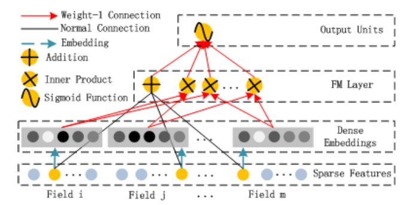

# 推荐系统之DeepFM
问题导向：
1. FM部分的数据怎么输入？  
2. Linear、FM和DNN的三部分如何结合？  
3. EMbedding中的权值怎么共享？

## DeepFM网络
<font color = "blue">**数据输入说明**</font> ：  
一阶：原始输入特征X  
二阶：Embedding向量两两交叉  
高阶：concat（稠密特征（归一化）, 稀疏特征（Embedding化））  
<font color = "blue">**图示**</font> ：  
  
<font color = "blue">**联合训练**</font> ：  
$$
y = sigmoid(y_{FM} + y_{DNN})\tag{1}
$$


```python
class BaseModel:
    pass

class DeepFM(BaseModel):
    """Instantiates the DeepFM Network architecture.

    :param linear_feature_columns: An iterable containing all the features used by linear part of the model.
    :param dnn_feature_columns: An iterable containing all the features used by deep part of the model.
    :param use_fm: bool,use FM part or not
    :param dnn_hidden_units: list,list of positive integer or empty list, the layer number and units in each layer of DNN
    :param l2_reg_linear: float. L2 regularizer strength applied to linear part
    :param l2_reg_embedding: float. L2 regularizer strength applied to embedding vector
    :param l2_reg_dnn: float. L2 regularizer strength applied to DNN
    :param init_std: float,to use as the initialize std of embedding vector
    :param seed: integer ,to use as random seed.
    :param dnn_dropout: float in [0,1), the probability we will drop out a given DNN coordinate.
    :param dnn_activation: Activation function to use in DNN
    :param dnn_use_bn: bool. Whether use BatchNormalization before activation or not in DNN
    :param task: str, ``"binary"`` for  binary logloss or  ``"regression"`` for regression loss
    :param device: str, ``"cpu"`` or ``"cuda:0"``
    :return: A PyTorch model instance.
    
    """

    def __init__(self,
                 linear_feature_columns, dnn_feature_columns, use_fm=True,
                 dnn_hidden_units=(256, 128),
                 l2_reg_linear=0.00001, l2_reg_embedding=0.00001, l2_reg_dnn=0, init_std=0.0001, seed=1024,
                 dnn_dropout=0,
                 dnn_activation='relu', dnn_use_bn=False, task='binary', device='cpu'):

        super(DeepFM, self).__init__(linear_feature_columns, dnn_feature_columns, l2_reg_linear=l2_reg_linear,
                                     l2_reg_embedding=l2_reg_embedding, init_std=init_std, seed=seed, task=task,
                                     device=device)

        self.use_fm = use_fm
        self.use_dnn = len(dnn_feature_columns) > 0 and len(
            dnn_hidden_units) > 0
        if use_fm:
            self.fm = FM()

        if self.use_dnn:
            self.dnn = DNN(self.compute_input_dim(dnn_feature_columns), dnn_hidden_units,
                           activation=dnn_activation, l2_reg=l2_reg_dnn, dropout_rate=dnn_dropout, use_bn=dnn_use_bn,
                           init_std=init_std, device=device)
            self.dnn_linear = nn.Linear(
                dnn_hidden_units[-1], 1, bias=False).to(device)

            self.add_regularization_weight(
                filter(lambda x: 'weight' in x[0] and 'bn' not in x[0], self.dnn.named_parameters()), l2_reg_dnn)
            self.add_regularization_weight(self.dnn_linear.weight, l2_reg_dnn)
        self.to(device)

    def forward(self, X):

        sparse_embedding_list, dense_value_list = self.input_from_feature_columns(X, self.dnn_feature_columns,
        
                                                                                  self.embedding_dict)
        # 1.线性层
        logit = self.linear_model(X)
        
        # 2.FM层
        if self.use_fm and len(sparse_embedding_list) > 0:
            # sparse_embedding_list -->(F, B, 1, 4)
            fm_input = torch.cat(sparse_embedding_list, dim=1) #（B, F, E）
            logit += self.fm(fm_input)
        
        # 3.Deep层(concat(稀疏特征(Embedding),稠密特征))
        if self.use_dnn:
            dnn_input = combined_dnn_input(
                sparse_embedding_list, dense_value_list)
            dnn_output = self.dnn(dnn_input)
            dnn_logit = self.dnn_linear(dnn_output)
            logit += dnn_logit

        y_pred = self.out(logit)

        return y_pred
```

## FM Part(二阶特征)
### 源代码

模型结构：  
  


```python
class FM(nn.Module):
    
    """Factorization Machine models pairwise (order-2) feature interactions
     without linear term and bias.
      Input shape
        - 3D tensor with shape: ``(batch_size,field_size,embedding_size)``.
      Output shape
        - 2D tensor with shape: ``(batch_size, 1)``.
      References
        - [Factorization Machines](https://www.csie.ntu.edu.tw/~b97053/paper/Rendle2010FM.pdf)
    """

    def __init__(self):
        super(FM, self).__init__()

    def forward(self, inputs):
        fm_input = inputs # (B, F, E)

        square_of_sum = torch.pow(torch.sum(fm_input, dim=1, keepdim=True), 2)  #　B * 1 * K
        sum_of_square = torch.sum(fm_input * fm_input, dim=1, keepdim=True)  # B * 1 * K
        cross_term = square_of_sum - sum_of_square
        cross_term = 0.5 * torch.sum(cross_term, dim=2, keepdim=False) # B * 1

        return cross_term
```


```python
# 实例化
fm = FM()
input_ = torch.rand((32, 26, 4))
```

### 交叉相关计算
交叉项计算公式：  
$$
交叉项：1/2*\sum_{i=1}^{k}((\sum_{i=1}^n{v_{ik}*x_{i}})^2 - \sum_{i=1}^{n}{v_{ik}^2*x_{i}^2})\tag{2}\\
$$
$$
inter1 := 1/2*\sum_{i=1}^{k}((\sum_{i=1}^n{v_{ik}*x_{i}})^2)\tag{3}\\
$$
$$
inter2 := 1/2*\sum_{i=1}^{k}(\sum_{i=1}^{n}{v_{ik}^2*x_{i}^2})\tag{4}
$$

FM原始的方法中只计算不为零的特征向量的隐权重向量向量，因此在特征稀疏的情况下，FM的求解会更加高效，而在DeepFM中交叉项为稀疏特征向量的Embedding向量(concat所有稀疏特征向量的embedding向量)两两交叉，实值为１, 例如：$x_i = 1, Ei.shape＝（1, k）$，因此，最终计算只涉及Embedding向量的计算：  


```python
# B*F*E (Ｆ:n_filed, E:embed_dims)
input_.shape
```


    torch.Size([32, 26, 4])


```python
# inter1
# B*1*K
inter1 = 0.5*torch.pow(torch.sum(input_, dim=1, keepdim=True), 2)
inter1.size()
```


    torch.Size([32, 1, 4])


```python
# inter2
# B*1*K
inter2 = 0.5*torch.sum(input_*input_, dim=1, keepdim=True)
inter2.size()
```


    torch.Size([32, 1, 4])


```python
# sum of cross
# B*1
torch.sum((inter1 - inter2), dim = 2, keepdim=False).size()
```


    torch.Size([32, 1])

## Linear层的探索(一阶特征)
### 线性层
<font color="red">注意</font>：一阶部分针对Embedding的处理


```python
class Linear(nn.Module):
    def __init__(self, feature_columns, feature_index, init_std=0.0001, device='cpu'):
        super(Linear, self).__init__()
        self.feature_index = feature_index
        self.device = device
        self.sparse_feature_columns = list(
            filter(lambda x: isinstance(x, SparseFeat), feature_columns)) if len(feature_columns) else []
        self.dense_feature_columns = list(
            filter(lambda x: isinstance(x, DenseFeat), feature_columns)) if len(feature_columns) else []

        self.varlen_sparse_feature_columns = list(
            filter(lambda x: isinstance(x, VarLenSparseFeat), feature_columns)) if len(feature_columns) else []

        self.embedding_dict = create_embedding_matrix(feature_columns, init_std, linear=True, sparse=False,
                                                      device=device)

        #         nn.ModuleDict(
        #             {feat.embedding_name: nn.Embedding(feat.dimension, 1, sparse=True) for feat in
        #              self.sparse_feature_columns}
        #         )
        # .to("cuda:1")
        for tensor in self.embedding_dict.values():
            nn.init.normal_(tensor.weight, mean=0, std=init_std)

        if len(self.dense_feature_columns) > 0:
            self.weight = nn.Parameter(torch.Tensor(sum(fc.dimension for fc in self.dense_feature_columns), 1).to(
                device))
            torch.nn.init.normal_(self.weight, mean=0, std=init_std)

    def forward(self, X, sparse_feat_refine_weight=None):

        sparse_embedding_list = [self.embedding_dict[feat.embedding_name](
            X[:, self.feature_index[feat.name][0]:self.feature_index[feat.name][1]].long()) for
            feat in self.sparse_feature_columns]

        dense_value_list = [X[:, self.feature_index[feat.name][0]:self.feature_index[feat.name][1]] for feat in
                            self.dense_feature_columns]

        varlen_embedding_list = get_varlen_pooling_list(self.embedding_dict, X, self.feature_index,
                                                        self.varlen_sparse_feature_columns, self.device)

        sparse_embedding_list += varlen_embedding_list

        linear_logit = torch.zeros([X.shape[0], 1]).to(sparse_embedding_list[0].device)
        
        if len(sparse_embedding_list) > 0:
            sparse_embedding_cat = torch.cat(sparse_embedding_list, dim=-1)
            if sparse_feat_refine_weight is not None:  # 稀疏特征定义权重
                # w_{x,i}=m_{x,i} * w_i (in IFM and DIFM)
                sparse_embedding_cat = sparse_embedding_cat * sparse_feat_refine_weight.unsqueeze(1)
            sparse_feat_logit = torch.sum(sparse_embedding_cat, dim=-1, keepdim=False)  # 稀疏的Embedding向量简单拼接没有独立权重
            linear_logit += sparse_feat_logit
            
        if len(dense_value_list) > 0:
            dense_value_logit = torch.cat(
                dense_value_list, dim=-1).matmul(self.weight)  # 稠密特征有独立权重
            linear_logit += dense_value_logit

        return linear_logit
```

### linear_sparse_logit

```python
# sparse_embedding_list
C = [torch.rand((32, 1, 4)) for i in range(26)]
```


```python
cat_vector = torch.cat(C, dim=-1)
cat_vector.size()
```


    torch.Size([32, 1, 104])


```python
logit = torch.sum(cat_vector, dim=-1, keepdim=False)
logit.size()
```


    torch.Size([32, 1])

### linear_dense_logit 

```python
# dense_value_list
weight = torch.rand(26, 1)
C = [torch.rand((32, 1)) for i in range(26)]
```


```python
# 拼接
dense_vector = torch.cat(C, dim=-1)
dense_vector.size()
```


    torch.Size([32, 26])


```python
# 加权求和
torch.matmul(dense_vector, weight).size()
```


    torch.Size([32, 1])

## FM实战练习

### 数据预处理


```python
train_data = pd.read_csv("../PNN模型/data/process/train_set.csv")
val_data = pd.read_csv("../PNN模型/data/process/val_set.csv")
test_data = pd.read_csv("../PNN模型/data/process/test_data.csv")
all_data = pd.concat([train_data, val_data], axis=0)
```


```python
# 编码信息
feature_names = all_data.columns.values.tolist()
sparse_feats = [c for c in feature_names if c[0] == "C"]
dense_feats = [c for c in feature_names if c[0] == "I"]
```


```python
# LabelEncoder
lb = LabelEncoder()
for feat in sparse_feats:
    all_data[feat] = lb.fit_transform(all_data[feat])
```


```python
fixlen_feature_colunms = [SparseFeat(feat, all_data[feat].nunique(), embedding_dim=Embed_dims) for feat in sparse_feats
                         ] + [DenseFeat(feat, dimension=1) for feat in dense_feats]

linear_feature_columns = fixlen_feature_colunms
dnn_feature_columns = fixlen_feature_colunms
all_feature_names = get_feature_names(linear_feature_columns + dnn_feature_columns)
```


```python
# 划分数据
train_data = all_data[:len(train_data)] 
val_data  = all_data[len(train_data):]

#　制作有标签的数据
# 注意数据类型为ndarray
train_x, train_y = train_data.iloc[:, :-1], train_data.iloc[:, -1].values
val_x, val_y = val_data.iloc[:, :-1], val_data.iloc[:, -1].values

train_model_input = {name:train_x[name].values for name in all_feature_names}
val_model_input = {name:val_x[name].values for name in all_feature_names}
```

### 模型训练


```python
device = 'cpu'
use_cuda = False
if use_cuda and torch.cuda.is_available():
    print('cuda ready...')
    device = 'cuda:0'
    
model = DeepFM(linear_feature_columns = linear_feature_columns
               , dnn_feature_columns = dnn_feature_columns
               , task = "binary"
               , device = device
              )

model.compile(optimizer = "adagrad"
              , loss = "binary_crossentropy"
              , metrics = ["binary_crossentropy", "auc"]
             )

history = model.fit(x = train_model_input
                    , y = train_y 
                    , batch_size = None
                    , epochs = 10
                    , validation_data = (val_model_input, val_y)
         )
```


### 模型评估
说明：数据量较小，模型复杂，出现严重过拟合现象。


```python
def plot_metric(dfhistory, metric, ax):
    """绘制评估曲线"""

    train_metrics = dfhistory[metric]
    val_metrics = dfhistory['val_' + metric]
    epochs = range(1, len(train_metrics) + 1)
    ax.plot(epochs, train_metrics, 'bo--')
    ax.plot(epochs, val_metrics, 'ro-')
    ax.set_title('Training and validation '+ metric, fontsize=15)
    ax.set_xlabel("Epochs", fontsize=14)
    ax.set_ylabel(metric, fontsize=14)
    ax.legend(["train_" + metric, 'val_' + metric], fontsize=12)
    ax.grid()
```


```python
# 观察损失和准确率的变化
dfhistory = history.history
fig, (ax1, ax2) = plt.subplots(1, 2, figsize=(18, 5))
plot_metric(dfhistory,"binary_crossentropy", ax1)
plot_metric(dfhistory,"auc", ax2)
```


    


## DeepFM的优点

优点： 
1) 它不需要任何预训练;  
2) 它学习高阶和低阶特征交互;   
3) 它介绍了一种特征嵌入的共享策略，以避免进行特征工程.  

## 参考

[deepFM in pytorch](https://blog.csdn.net/w55100/article/details/90295932#t5)  
[DeepFM算法](https://www.jianshu.com/p/d199312eda64)  
[DeepCTR0-Torch](https://github.com/shenweichen/DeepCTR-Torch/blob/master/deepctr_torch/models/deepfm.py)
[DeepFM算法解析](https://blog.csdn.net/zhongqiqianga/article/details/103714616)  
[DeepFM论文详解](http://mp.weixin.qq.com/s?src=11&timestamp=1618726188&ver=3015&signature=4SGPT4d2qjcYcSAmPq-l66VeTG1HFnhoLRzHMmFUwX9QE67aheKVc265FPqIZ9fdoATd21afjDgGROUwvdOiqjwDYJj427aS*KKrAa9JMNoAQCnMlXbdmqQHVz*MstzI&new=1)  