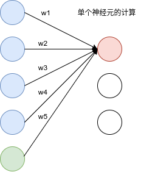
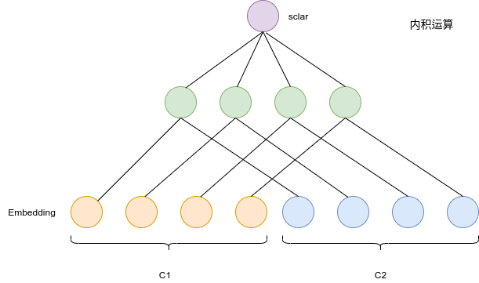
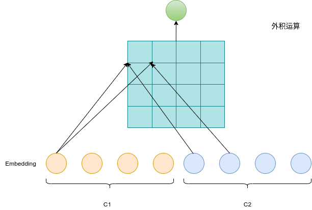
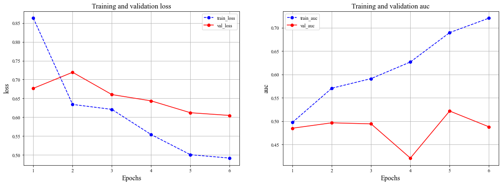

# 推荐系统之PNN

==推荐优先阅读：==[AI上推荐 之 NeuralCF与PNN模型(改变特征交叉方式）](https://blog.csdn.net/wuzhongqiang/article/details/108985457) 

```python
import pandas as pd
import numpy as np
from sklearn.preprocessing import MinMaxScaler
from sklearn.preprocessing import LabelEncoder
from sklearn.model_selection import train_test_split
import torch
from torch.utils.data import DataLoader, TensorDataset
from torch import nn
from torch.nn import functional as F
from sklearn.metrics import roc_auc_score
import datetime
import matplotlib.pyplot as plt
from tqdm import tqdm
import warnings
from matplotlib import rcParams
from torch.utils.tensorboard import SummaryWriter

warnings.filterwarnings("ignore")
config = {
    "font.family":'Times New Roman',  # 设置字体类型
}

rcParams.update(config)
```

# 预处理数据


```python
train_data = pd.read_csv("./data/train.csv")
test_data = pd.read_csv("./data/test.csv")
```


```python
train_data
```

<table border="1" class="dataframe">
  <thead>
    <tr style="text-align: right;">
      <th></th>
      <th>Id</th>
      <th>Label</th>
      <th>I1</th>
      <th>I2</th>
      <th>I3</th>
      <th>I4</th>
      <th>I5</th>
      <th>I6</th>
      <th>I7</th>
      <th>I8</th>
      <th>...</th>
      <th>C17</th>
      <th>C18</th>
      <th>C19</th>
      <th>C20</th>
      <th>C21</th>
      <th>C22</th>
      <th>C23</th>
      <th>C24</th>
      <th>C25</th>
      <th>C26</th>
    </tr>
  </thead>
  <tbody>
    <tr>
      <th>0</th>
      <td>10000743</td>
      <td>1</td>
      <td>1.0</td>
      <td>0</td>
      <td>1.0</td>
      <td>NaN</td>
      <td>227.0</td>
      <td>1.0</td>
      <td>173.0</td>
      <td>18.0</td>
      <td>...</td>
      <td>3486227d</td>
      <td>e88ffc9d</td>
      <td>c393dc22</td>
      <td>b1252a9d</td>
      <td>57c90cd9</td>
      <td>NaN</td>
      <td>bcdee96c</td>
      <td>4d19a3eb</td>
      <td>cb079c2d</td>
      <td>456c12a0</td>
    </tr>
    <tr>
      <th>1</th>
      <td>10000159</td>
      <td>1</td>
      <td>4.0</td>
      <td>1</td>
      <td>1.0</td>
      <td>2.0</td>
      <td>27.0</td>
      <td>2.0</td>
      <td>4.0</td>
      <td>2.0</td>
      <td>...</td>
      <td>07c540c4</td>
      <td>92555263</td>
      <td>NaN</td>
      <td>NaN</td>
      <td>242bb710</td>
      <td>NaN</td>
      <td>3a171ecb</td>
      <td>72c78f11</td>
      <td>NaN</td>
      <td>NaN</td>
    </tr>
    <tr>
      <th>2</th>
      <td>10001166</td>
      <td>1</td>
      <td>0.0</td>
      <td>806</td>
      <td>NaN</td>
      <td>NaN</td>
      <td>1752.0</td>
      <td>142.0</td>
      <td>2.0</td>
      <td>0.0</td>
      <td>...</td>
      <td>07c540c4</td>
      <td>25c88e42</td>
      <td>21ddcdc9</td>
      <td>b1252a9d</td>
      <td>a0136dd2</td>
      <td>NaN</td>
      <td>32c7478e</td>
      <td>8fc66e78</td>
      <td>001f3601</td>
      <td>f37f3967</td>
    </tr>
    <tr>
      <th>3</th>
      <td>10000318</td>
      <td>0</td>
      <td>2.0</td>
      <td>-1</td>
      <td>42.0</td>
      <td>14.0</td>
      <td>302.0</td>
      <td>38.0</td>
      <td>25.0</td>
      <td>38.0</td>
      <td>...</td>
      <td>e5ba7672</td>
      <td>5aed7436</td>
      <td>21ddcdc9</td>
      <td>b1252a9d</td>
      <td>c3abeb21</td>
      <td>NaN</td>
      <td>423fab69</td>
      <td>1793a828</td>
      <td>e8b83407</td>
      <td>5cef228f</td>
    </tr>
    <tr>
      <th>4</th>
      <td>10000924</td>
      <td>1</td>
      <td>0.0</td>
      <td>57</td>
      <td>2.0</td>
      <td>1.0</td>
      <td>2891.0</td>
      <td>2.0</td>
      <td>35.0</td>
      <td>1.0</td>
      <td>...</td>
      <td>e5ba7672</td>
      <td>642f2610</td>
      <td>1d1eb838</td>
      <td>b1252a9d</td>
      <td>1640d50b</td>
      <td>ad3062eb</td>
      <td>423fab69</td>
      <td>45ab94c8</td>
      <td>2bf691b1</td>
      <td>c84c4aec</td>
    </tr>
    <tr>
      <th>...</th>
      <td>...</td>
      <td>...</td>
      <td>...</td>
      <td>...</td>
      <td>...</td>
      <td>...</td>
      <td>...</td>
      <td>...</td>
      <td>...</td>
      <td>...</td>
      <td>...</td>
      <td>...</td>
      <td>...</td>
      <td>...</td>
      <td>...</td>
      <td>...</td>
      <td>...</td>
      <td>...</td>
      <td>...</td>
      <td>...</td>
      <td>...</td>
    </tr>
    <tr>
      <th>1594</th>
      <td>10000835</td>
      <td>0</td>
      <td>NaN</td>
      <td>8</td>
      <td>1.0</td>
      <td>1.0</td>
      <td>43.0</td>
      <td>NaN</td>
      <td>0.0</td>
      <td>1.0</td>
      <td>...</td>
      <td>1e88c74f</td>
      <td>fc35e8fe</td>
      <td>NaN</td>
      <td>NaN</td>
      <td>a02708ad</td>
      <td>c9d4222a</td>
      <td>c3dc6cef</td>
      <td>502f2493</td>
      <td>NaN</td>
      <td>NaN</td>
    </tr>
    <tr>
      <th>1595</th>
      <td>10001216</td>
      <td>0</td>
      <td>8.0</td>
      <td>2</td>
      <td>20.0</td>
      <td>8.0</td>
      <td>36.0</td>
      <td>9.0</td>
      <td>8.0</td>
      <td>10.0</td>
      <td>...</td>
      <td>e5ba7672</td>
      <td>5aed7436</td>
      <td>21ddcdc9</td>
      <td>b1252a9d</td>
      <td>eea796be</td>
      <td>NaN</td>
      <td>3a171ecb</td>
      <td>1793a828</td>
      <td>e8b83407</td>
      <td>5cef228f</td>
    </tr>
    <tr>
      <th>1596</th>
      <td>10001653</td>
      <td>0</td>
      <td>0.0</td>
      <td>1</td>
      <td>2.0</td>
      <td>12.0</td>
      <td>4877.0</td>
      <td>140.0</td>
      <td>13.0</td>
      <td>34.0</td>
      <td>...</td>
      <td>e5ba7672</td>
      <td>2b0a9d11</td>
      <td>NaN</td>
      <td>NaN</td>
      <td>7453e535</td>
      <td>NaN</td>
      <td>dbb486d7</td>
      <td>906e72ec</td>
      <td>NaN</td>
      <td>NaN</td>
    </tr>
    <tr>
      <th>1597</th>
      <td>10000559</td>
      <td>0</td>
      <td>NaN</td>
      <td>2</td>
      <td>NaN</td>
      <td>1.0</td>
      <td>1972.0</td>
      <td>NaN</td>
      <td>0.0</td>
      <td>1.0</td>
      <td>...</td>
      <td>e5ba7672</td>
      <td>817481a8</td>
      <td>NaN</td>
      <td>NaN</td>
      <td>e4244d7f</td>
      <td>c9d4222a</td>
      <td>c7dc6720</td>
      <td>60efe6e6</td>
      <td>NaN</td>
      <td>NaN</td>
    </tr>
    <tr>
      <th>1598</th>
      <td>10000684</td>
      <td>1</td>
      <td>NaN</td>
      <td>34</td>
      <td>3.0</td>
      <td>4.0</td>
      <td>NaN</td>
      <td>NaN</td>
      <td>0.0</td>
      <td>4.0</td>
      <td>...</td>
      <td>2005abd1</td>
      <td>1cdbd1c5</td>
      <td>NaN</td>
      <td>NaN</td>
      <td>288eaded</td>
      <td>c9d4222a</td>
      <td>bcdee96c</td>
      <td>8fc66e78</td>
      <td>NaN</td>
      <td>NaN</td>
    </tr>
  </tbody>
</table>
<p>1599 rows × 41 columns</p>


```python
test_data
```

<table border="1" class="dataframe">
  <thead>
    <tr style="text-align: right;">
      <th></th>
      <th>Id</th>
      <th>I1</th>
      <th>I2</th>
      <th>I3</th>
      <th>I4</th>
      <th>I5</th>
      <th>I6</th>
      <th>I7</th>
      <th>I8</th>
      <th>I9</th>
      <th>...</th>
      <th>C17</th>
      <th>C18</th>
      <th>C19</th>
      <th>C20</th>
      <th>C21</th>
      <th>C22</th>
      <th>C23</th>
      <th>C24</th>
      <th>C25</th>
      <th>C26</th>
    </tr>
  </thead>
  <tbody>
    <tr>
      <th>0</th>
      <td>10000405</td>
      <td>NaN</td>
      <td>-1</td>
      <td>NaN</td>
      <td>NaN</td>
      <td>8020.0</td>
      <td>26.0</td>
      <td>6.0</td>
      <td>0.0</td>
      <td>80.0</td>
      <td>...</td>
      <td>e5ba7672</td>
      <td>7119e567</td>
      <td>1d04f4a4</td>
      <td>b1252a9d</td>
      <td>d5f54153</td>
      <td>NaN</td>
      <td>32c7478e</td>
      <td>a9d771cd</td>
      <td>c9f3bea7</td>
      <td>0a47000d</td>
    </tr>
    <tr>
      <th>1</th>
      <td>10001189</td>
      <td>NaN</td>
      <td>-1</td>
      <td>NaN</td>
      <td>NaN</td>
      <td>17881.0</td>
      <td>9.0</td>
      <td>8.0</td>
      <td>0.0</td>
      <td>0.0</td>
      <td>...</td>
      <td>e5ba7672</td>
      <td>51369abb</td>
      <td>NaN</td>
      <td>NaN</td>
      <td>d4b6b7e8</td>
      <td>NaN</td>
      <td>32c7478e</td>
      <td>37821b83</td>
      <td>NaN</td>
      <td>NaN</td>
    </tr>
    <tr>
      <th>2</th>
      <td>10000674</td>
      <td>0.0</td>
      <td>0</td>
      <td>2.0</td>
      <td>13.0</td>
      <td>2904.0</td>
      <td>104.0</td>
      <td>1.0</td>
      <td>3.0</td>
      <td>100.0</td>
      <td>...</td>
      <td>e5ba7672</td>
      <td>bd17c3da</td>
      <td>966f1c31</td>
      <td>a458ea53</td>
      <td>1d1393f4</td>
      <td>ad3062eb</td>
      <td>32c7478e</td>
      <td>3fdb382b</td>
      <td>010f6491</td>
      <td>49d68486</td>
    </tr>
    <tr>
      <th>3</th>
      <td>10001358</td>
      <td>0.0</td>
      <td>1471</td>
      <td>51.0</td>
      <td>4.0</td>
      <td>1573.0</td>
      <td>63.0</td>
      <td>1.0</td>
      <td>4.0</td>
      <td>13.0</td>
      <td>...</td>
      <td>d4bb7bd8</td>
      <td>1f9656b8</td>
      <td>21ddcdc9</td>
      <td>b1252a9d</td>
      <td>602ce342</td>
      <td>NaN</td>
      <td>3a171ecb</td>
      <td>1793a828</td>
      <td>e8b83407</td>
      <td>70b6702c</td>
    </tr>
    <tr>
      <th>4</th>
      <td>10000810</td>
      <td>0.0</td>
      <td>16</td>
      <td>9.0</td>
      <td>17.0</td>
      <td>2972.0</td>
      <td>621.0</td>
      <td>13.0</td>
      <td>42.0</td>
      <td>564.0</td>
      <td>...</td>
      <td>e5ba7672</td>
      <td>87c6f83c</td>
      <td>NaN</td>
      <td>NaN</td>
      <td>bf8efd4c</td>
      <td>c9d4222a</td>
      <td>423fab69</td>
      <td>f96a556f</td>
      <td>NaN</td>
      <td>NaN</td>
    </tr>
    <tr>
      <th>...</th>
      <td>...</td>
      <td>...</td>
      <td>...</td>
      <td>...</td>
      <td>...</td>
      <td>...</td>
      <td>...</td>
      <td>...</td>
      <td>...</td>
      <td>...</td>
      <td>...</td>
      <td>...</td>
      <td>...</td>
      <td>...</td>
      <td>...</td>
      <td>...</td>
      <td>...</td>
      <td>...</td>
      <td>...</td>
      <td>...</td>
      <td>...</td>
    </tr>
    <tr>
      <th>395</th>
      <td>10001453</td>
      <td>1.0</td>
      <td>0</td>
      <td>1.0</td>
      <td>NaN</td>
      <td>149.0</td>
      <td>5.0</td>
      <td>1.0</td>
      <td>0.0</td>
      <td>0.0</td>
      <td>...</td>
      <td>d4bb7bd8</td>
      <td>5aed7436</td>
      <td>d16737e3</td>
      <td>a458ea53</td>
      <td>edc49a33</td>
      <td>NaN</td>
      <td>93bad2c0</td>
      <td>3fdb382b</td>
      <td>e8b83407</td>
      <td>80dd0a5b</td>
    </tr>
    <tr>
      <th>396</th>
      <td>10000360</td>
      <td>NaN</td>
      <td>-1</td>
      <td>NaN</td>
      <td>NaN</td>
      <td>NaN</td>
      <td>NaN</td>
      <td>0.0</td>
      <td>0.0</td>
      <td>6.0</td>
      <td>...</td>
      <td>2005abd1</td>
      <td>5162930e</td>
      <td>NaN</td>
      <td>NaN</td>
      <td>12965bb8</td>
      <td>NaN</td>
      <td>32c7478e</td>
      <td>71292dbb</td>
      <td>NaN</td>
      <td>NaN</td>
    </tr>
    <tr>
      <th>397</th>
      <td>10001809</td>
      <td>0.0</td>
      <td>300</td>
      <td>4.0</td>
      <td>NaN</td>
      <td>4622.0</td>
      <td>25.0</td>
      <td>20.0</td>
      <td>6.0</td>
      <td>55.0</td>
      <td>...</td>
      <td>8efede7f</td>
      <td>a78bd508</td>
      <td>21ddcdc9</td>
      <td>5840adea</td>
      <td>c2a93b37</td>
      <td>NaN</td>
      <td>3a171ecb</td>
      <td>1793a828</td>
      <td>e8b83407</td>
      <td>2fede552</td>
    </tr>
    <tr>
      <th>398</th>
      <td>10000769</td>
      <td>1.0</td>
      <td>1</td>
      <td>2.0</td>
      <td>1.0</td>
      <td>5.0</td>
      <td>1.0</td>
      <td>1.0</td>
      <td>1.0</td>
      <td>1.0</td>
      <td>...</td>
      <td>d4bb7bd8</td>
      <td>a1d0cc4f</td>
      <td>c68db44a</td>
      <td>a458ea53</td>
      <td>3b1ae854</td>
      <td>NaN</td>
      <td>32c7478e</td>
      <td>57e2c6c9</td>
      <td>1575c75f</td>
      <td>7132fed8</td>
    </tr>
    <tr>
      <th>399</th>
      <td>10000563</td>
      <td>NaN</td>
      <td>2</td>
      <td>NaN</td>
      <td>NaN</td>
      <td>36144.0</td>
      <td>NaN</td>
      <td>NaN</td>
      <td>36.0</td>
      <td>NaN</td>
      <td>...</td>
      <td>e5ba7672</td>
      <td>7b49e3d2</td>
      <td>NaN</td>
      <td>NaN</td>
      <td>dfcfc3fa</td>
      <td>NaN</td>
      <td>423fab69</td>
      <td>aee52b6f</td>
      <td>NaN</td>
      <td>NaN</td>
    </tr>
  </tbody>
</table>
<p>400 rows × 40 columns</p>

```python
lable = train_data["Label"]
del train_data["Label"]
all_data = pd.concat([train_data, test_data])
del all_data["Id"]
```


```python
# 整理数据
features = all_data.columns
spase_feature = [c for c in features if c[0] == "C"]  # 类别性变量
dense_feature = [c for c in features if c[0] == "I"]  # 数值性变量

# 填补缺失值
all_data[spase_feature] = all_data[spase_feature].fillna("-1")
all_data[dense_feature] = all_data[dense_feature].fillna("0")
```


```python
# 分类特征编码数据
for feature in spase_feature:
    le = LabelEncoder()
    le = le.fit(all_data[feature])
    all_data[feature] = le.transform(all_data[feature])
```


```python
# 数值特征归一化操作
mm = MinMaxScaler()
all_data[dense_feature] = mm.fit_transform(all_data[dense_feature])
```


```python
train = all_data[:len(train_data)]
test_data = all_data[len(train_data):]
train["Label"] = lable
train_set, val_set = train_test_split(train, test_size=0.2, random_state=2021)
```


```python
# 保存处理好的数据
train_set = train_set.reset_index(drop=True)
val_set = val_set.reset_index(drop=True)

train_set.to_csv("./data/train_set.csv", index=False)
val_set.to_csv("./data/val_set.csv", index=False)
test_data.to_csv("./data/test_data.csv", index=False)
```

# 转换数据类型


```python
# 读取数据
train_set = pd.read_csv("./data/train_set.csv")
val_set = pd.read_csv("./data/val_set.csv")
test_data = pd.read_csv("./data/test_data.csv")
```


```python
# 合并数据
all_data_df = pd.concat((train_set, val_set, test_data))
all_data_df
```

<table border="1" class="dataframe">
  <thead>
    <tr style="text-align: right;">
      <th></th>
      <th>I1</th>
      <th>I2</th>
      <th>I3</th>
      <th>I4</th>
      <th>I5</th>
      <th>I6</th>
      <th>I7</th>
      <th>I8</th>
      <th>I9</th>
      <th>I10</th>
      <th>...</th>
      <th>C18</th>
      <th>C19</th>
      <th>C20</th>
      <th>C21</th>
      <th>C22</th>
      <th>C23</th>
      <th>C24</th>
      <th>C25</th>
      <th>C26</th>
      <th>Label</th>
    </tr>
  </thead>
  <tbody>
    <tr>
      <th>0</th>
      <td>0.021053</td>
      <td>0.011442</td>
      <td>0.000000</td>
      <td>0.034483</td>
      <td>0.000040</td>
      <td>0.000647</td>
      <td>0.014475</td>
      <td>0.000000</td>
      <td>0.027142</td>
      <td>0.25</td>
      <td>...</td>
      <td>253</td>
      <td>0</td>
      <td>0</td>
      <td>105</td>
      <td>0</td>
      <td>1</td>
      <td>165</td>
      <td>0</td>
      <td>0</td>
      <td>0.0</td>
    </tr>
    <tr>
      <th>1</th>
      <td>0.000000</td>
      <td>0.001907</td>
      <td>0.000000</td>
      <td>0.011494</td>
      <td>0.057332</td>
      <td>0.067917</td>
      <td>0.000000</td>
      <td>0.001828</td>
      <td>0.013128</td>
      <td>0.00</td>
      <td>...</td>
      <td>160</td>
      <td>0</td>
      <td>0</td>
      <td>316</td>
      <td>3</td>
      <td>0</td>
      <td>520</td>
      <td>0</td>
      <td>0</td>
      <td>0.0</td>
    </tr>
    <tr>
      <th>2</th>
      <td>0.000000</td>
      <td>0.016400</td>
      <td>0.000118</td>
      <td>0.034483</td>
      <td>0.001658</td>
      <td>0.004097</td>
      <td>0.015682</td>
      <td>0.031079</td>
      <td>0.084265</td>
      <td>0.00</td>
      <td>...</td>
      <td>392</td>
      <td>193</td>
      <td>2</td>
      <td>256</td>
      <td>3</td>
      <td>10</td>
      <td>175</td>
      <td>2</td>
      <td>150</td>
      <td>1.0</td>
    </tr>
    <tr>
      <th>3</th>
      <td>0.000000</td>
      <td>0.000254</td>
      <td>0.001301</td>
      <td>0.103448</td>
      <td>0.015978</td>
      <td>0.192324</td>
      <td>0.004825</td>
      <td>0.082267</td>
      <td>0.077524</td>
      <td>0.00</td>
      <td>...</td>
      <td>390</td>
      <td>0</td>
      <td>0</td>
      <td>2</td>
      <td>0</td>
      <td>10</td>
      <td>163</td>
      <td>0</td>
      <td>0</td>
      <td>1.0</td>
    </tr>
    <tr>
      <th>4</th>
      <td>0.000000</td>
      <td>0.000127</td>
      <td>0.000000</td>
      <td>0.000000</td>
      <td>0.317903</td>
      <td>0.000000</td>
      <td>0.000000</td>
      <td>0.001828</td>
      <td>0.000887</td>
      <td>0.00</td>
      <td>...</td>
      <td>313</td>
      <td>23</td>
      <td>1</td>
      <td>997</td>
      <td>0</td>
      <td>1</td>
      <td>125</td>
      <td>28</td>
      <td>398</td>
      <td>0.0</td>
    </tr>
    <tr>
      <th>...</th>
      <td>...</td>
      <td>...</td>
      <td>...</td>
      <td>...</td>
      <td>...</td>
      <td>...</td>
      <td>...</td>
      <td>...</td>
      <td>...</td>
      <td>...</td>
      <td>...</td>
      <td>...</td>
      <td>...</td>
      <td>...</td>
      <td>...</td>
      <td>...</td>
      <td>...</td>
      <td>...</td>
      <td>...</td>
      <td>...</td>
      <td>...</td>
    </tr>
    <tr>
      <th>395</th>
      <td>0.010526</td>
      <td>0.000254</td>
      <td>0.000118</td>
      <td>0.000000</td>
      <td>0.000147</td>
      <td>0.001078</td>
      <td>0.000603</td>
      <td>0.000000</td>
      <td>0.000000</td>
      <td>0.25</td>
      <td>...</td>
      <td>188</td>
      <td>166</td>
      <td>2</td>
      <td>1127</td>
      <td>0</td>
      <td>5</td>
      <td>175</td>
      <td>27</td>
      <td>262</td>
      <td>NaN</td>
    </tr>
    <tr>
      <th>396</th>
      <td>0.000000</td>
      <td>0.000127</td>
      <td>0.000000</td>
      <td>0.000000</td>
      <td>0.000000</td>
      <td>0.000000</td>
      <td>0.000000</td>
      <td>0.000000</td>
      <td>0.001064</td>
      <td>0.00</td>
      <td>...</td>
      <td>172</td>
      <td>0</td>
      <td>0</td>
      <td>83</td>
      <td>0</td>
      <td>0</td>
      <td>333</td>
      <td>0</td>
      <td>0</td>
      <td>NaN</td>
    </tr>
    <tr>
      <th>397</th>
      <td>0.000000</td>
      <td>0.038393</td>
      <td>0.000473</td>
      <td>0.000000</td>
      <td>0.004553</td>
      <td>0.005390</td>
      <td>0.012063</td>
      <td>0.010969</td>
      <td>0.009757</td>
      <td>0.00</td>
      <td>...</td>
      <td>347</td>
      <td>23</td>
      <td>1</td>
      <td>922</td>
      <td>0</td>
      <td>1</td>
      <td>67</td>
      <td>27</td>
      <td>91</td>
      <td>NaN</td>
    </tr>
    <tr>
      <th>398</th>
      <td>0.010526</td>
      <td>0.000381</td>
      <td>0.000236</td>
      <td>0.011494</td>
      <td>0.000005</td>
      <td>0.000216</td>
      <td>0.000603</td>
      <td>0.001828</td>
      <td>0.000177</td>
      <td>0.25</td>
      <td>...</td>
      <td>335</td>
      <td>155</td>
      <td>2</td>
      <td>287</td>
      <td>0</td>
      <td>0</td>
      <td>253</td>
      <td>3</td>
      <td>238</td>
      <td>NaN</td>
    </tr>
    <tr>
      <th>399</th>
      <td>0.000000</td>
      <td>0.000509</td>
      <td>0.000000</td>
      <td>0.000000</td>
      <td>0.035602</td>
      <td>0.000000</td>
      <td>0.000000</td>
      <td>0.065814</td>
      <td>0.000000</td>
      <td>0.00</td>
      <td>...</td>
      <td>252</td>
      <td>0</td>
      <td>0</td>
      <td>1062</td>
      <td>0</td>
      <td>2</td>
      <td>531</td>
      <td>0</td>
      <td>0</td>
      <td>NaN</td>
    </tr>
  </tbody>
</table>
<p>1999 rows × 40 columns</p>

```python
# 取出稀疏特征，统计变量取值范围，进行Embedding
features = all_data_df.columns
spase_feature = [c for c in features if c[0] == "C"]  # 类别性变量
dense_feature = [c for c in features if c[0] == "I"]  # 数值性变量

# 统计
spase_feats_map = {}
for feature in spase_feature:
    spase_feats_map[feature] = all_data_df[feature].nunique()

# 保存
feature_info = [dense_feature, spase_feature, spase_feats_map]
```


```python
# 准备数据, 构造dataset
train_dataset = TensorDataset(torch.tensor(train_set.drop(columns="Label").values).float()
                                 , torch.tensor(train_set["Label"].values).float()
                                )

val_dataset = TensorDataset(torch.tensor(val_set.drop(columns="Label").values).float()
                                , torch.tensor(val_set["Label"]).float()
                               )
```


```python
train_dataloader = DataLoader(train_dataset
                              , shuffle = True
                              , batch_size = 16
                             )

val_dataloader = DataLoader(val_dataset
                             , shuffle = True
                             , batch_size = 16
                            )
```

# 模型
**主要思想**：PNN模型用乘积层(Product layer)代替了Deep Crossing模型中的Stacking层，也就是说，不同特征的Embedding向量不在是简单的拼接，==而是用Product操作进行两两交互，更有针对性地获取特征之间的交叉信息==。另外，相比与NeruralCF,PNN模型的输入不仅包括用户和物品信息，还可以有更多不同的形式、不同来源的特征，通过Embedding层的编码生成同样长度的稠密特征Embedding向量。  


## DNN


```python
class DNN(nn.Module):
    
    def __init__(self, hidden_units, dropout = 0):
        
        super(DNN, self).__init__()
        
        self.dnn = nn.ModuleList([nn.Linear(layer[0], layer[1]) for layer in zip(hidden_units[:-1], hidden_units[1:])])
        self.dropout = nn.Dropout(p = dropout)
        
    def forward(self, x):
        
        for linear in self.dnn:
            x = linear(x)
            x = F.relu(x)
        x = self.dropout(x)
        
        return x
```


```python
DNN([512, 256, 128, 64, 32, 16])
```


    DNN(
      (dnn): ModuleList(
        (0): Linear(in_features=512, out_features=256, bias=True)
        (1): Linear(in_features=256, out_features=128, bias=True)
        (2): Linear(in_features=128, out_features=64, bias=True)
        (3): Linear(in_features=64, out_features=32, bias=True)
        (4): Linear(in_features=32, out_features=16, bias=True)
      )
      (dropout): Dropout(p=0, inplace=False)
    )

## Product Layer
product思想来源于，在ctr预估中，认为特征之间的关系更多是一种and“且”的关系，而非add “或”的关系。例如，性别为男且喜欢游戏的人群，比起性别男和喜欢游戏的人群，前者的组合比后者更能体现特征交叉的意义。


```python
class Productlayer(nn.Module):

    def __init__(self, mode, embed_nums, filed_nums, hidden_units):
        """
        :param mode: l_P互操作方式
        :param embed_nums: Embedding嵌入维度
        :param filed_nums:
        :param hidden_units:
        """
        super(Productlayer, self).__init__()
        self.mode = mode
        # z部分和p部分采用局部全连接的思路，并未之间将交互后的特征送入L1层中
        
        # z部分
        self.w_z = nn.Parameter(torch.rand([filed_nums, embed_nums, hidden_units[0]]))

        # p部分
        if self.mode == "in":  # 内积方式
            self.w_p = nn.Parameter(torch.rand([filed_nums, filed_nums, hidden_units[0]]))
        else:  # 外积方式
            self.w_p = nn.Parameter(torch.rand([embed_nums, embed_nums, hidden_units[0]]))

        self.l_b = torch.rand([hidden_units[0], ], requires_grad=True)

    def forward(self, z, sparse_embeds):

        #  l_z:线性部分
        l_z = torch.mm(z.reshape(z.shape[0], -1),
                       self.w_z.permute((2, 0, 1)).reshape(self.w_z.shape[2], -1).T)  # [B, hidden_units[0]]

        #  l_p:特征交叉部分
        if self.mode == "in":
            p = torch.matmul(sparse_embeds, sparse_embeds.permute((0, 2, 1)))  # [B, field_dim, field_dim]
        else:
            f_sum = torch.unsqueeze(torch.sum(sparse_embeds, dim=1), dim=1)  # [B, 1, embed_dim]
            p = torch.matmul(f_sum.permute((0, 2, 1)), f_sum)  # [B, embed_dim, embed_dim]

        l_p = torch.mm(p.reshape(p.shape[0], -1), self.w_p.permute((2, 0, 1)).reshape(self.w_p.shape[2], -1).T)

        output = l_p + l_z + self.l_b

        return output
```

### 知识点: 向量内积和外积

### 线性部分



```python
# 3个样本， 2个类别特征， embeddin维度是4  6个单元输出(样本数目*(特征维数*embed_dims))
torch.manual_seed(1)
a = torch.rand([3, 2, 4])
b = torch.rand([2, 4, 6])
```


```python
a, b
```


    (tensor([[[0.7576, 0.2793, 0.4031, 0.7347],
              [0.0293, 0.7999, 0.3971, 0.7544]],
     
             [[0.5695, 0.4388, 0.6387, 0.5247],
              [0.6826, 0.3051, 0.4635, 0.4550]],
     
             [[0.5725, 0.4980, 0.9371, 0.6556],
              [0.3138, 0.1980, 0.4162, 0.2843]]]),
     tensor([[[0.3398, 0.5239, 0.7981, 0.7718, 0.0112, 0.8100],
              [0.6397, 0.9743, 0.8300, 0.0444, 0.0246, 0.2588],
              [0.9391, 0.4167, 0.7140, 0.2676, 0.9906, 0.2885],
              [0.8750, 0.5059, 0.2366, 0.7570, 0.2346, 0.6471]],
     
             [[0.3556, 0.4452, 0.0193, 0.2616, 0.7713, 0.3785],
              [0.9980, 0.9008, 0.4766, 0.1663, 0.8045, 0.6552],
              [0.1768, 0.8248, 0.8036, 0.9434, 0.2197, 0.4177],
              [0.4903, 0.5730, 0.1205, 0.1452, 0.7720, 0.3828]]]))


```python
#  [B, (embed_dims*feat_nums)]
a.reshape(a.shape[0], -1)
```


    tensor([[0.7576, 0.2793, 0.4031, 0.7347, 0.0293, 0.7999, 0.3971, 0.7544],
            [0.5695, 0.4388, 0.6387, 0.5247, 0.6826, 0.3051, 0.4635, 0.4550],
            [0.5725, 0.4980, 0.9371, 0.6556, 0.3138, 0.1980, 0.4162, 0.2843]])


```python
b.permute((2, 0, 1)).reshape(b.shape[2], -1).T
```


    tensor([[0.3398, 0.5239, 0.7981, 0.7718, 0.0112, 0.8100],
            [0.6397, 0.9743, 0.8300, 0.0444, 0.0246, 0.2588],
            [0.9391, 0.4167, 0.7140, 0.2676, 0.9906, 0.2885],
            [0.8750, 0.5059, 0.2366, 0.7570, 0.2346, 0.6471],
            [0.3556, 0.4452, 0.0193, 0.2616, 0.7713, 0.3785],
            [0.9980, 0.9008, 0.4766, 0.1663, 0.8045, 0.6552],
            [0.1768, 0.8248, 0.8036, 0.9434, 0.2197, 0.4177],
            [0.4903, 0.5730, 0.1205, 0.1452, 0.7720, 0.3828]])


```python
torch.matmul(a.reshape(a.shape[0], -1), b.permute((2, 0, 1)).reshape(b.shape[2], -1).T)
```


    tensor([[2.7062, 2.7021, 2.0899, 1.8860, 1.9227, 2.2673],
            [2.3853, 2.4793, 1.9848, 1.7598, 1.9980, 1.9246],
            [2.4889, 2.3316, 2.1635, 1.7600, 1.8130, 1.8183]])

### 向量的内积
向量：  
        </p>
向量内积运算：</p>
图示：  



```python
a.shape
```


    torch.Size([3, 2, 4])


```python
# 两两向量先内积运算
a, a.permute((0, 2, 1))
```


    (tensor([[[0.7576, 0.2793, 0.4031, 0.7347],
              [0.0293, 0.7999, 0.3971, 0.7544]],
     
             [[0.5695, 0.4388, 0.6387, 0.5247],
              [0.6826, 0.3051, 0.4635, 0.4550]],
     
             [[0.5725, 0.4980, 0.9371, 0.6556],
              [0.3138, 0.1980, 0.4162, 0.2843]]]),
     tensor([[[0.7576, 0.0293],
              [0.2793, 0.7999],
              [0.4031, 0.3971],
              [0.7347, 0.7544]],
     
             [[0.5695, 0.6826],
              [0.4388, 0.3051],
              [0.6387, 0.4635],
              [0.5247, 0.4550]],
     
             [[0.5725, 0.3138],
              [0.4980, 0.1980],
              [0.9371, 0.4162],
              [0.6556, 0.2843]]]))


```python
p = torch.matmul(a, a.permute((0, 2, 1)))  # [None, field_num. field_num]
p
```


    tensor([[[1.3542, 0.9599],
             [0.9599, 1.3674]],
    
            [[1.2001, 1.0574],
             [1.0574, 0.9810]],
    
            [[1.8837, 0.8547],
             [0.8547, 0.3917]]])

### 向量的外积
向量：  
        </p>
向量外积运算：</p>
图示：　　



```python
# 通过元素相乘的叠加，也就是先叠加N个field的Embedding向量，然后做乘法，可以大幅减少时间复杂度
f_sum = torch.unsqueeze(torch.sum(a, dim=1), dim=1)  # 同一样本的所有embeding向量求和
a, f_sum
```


    (tensor([[[0.7576, 0.2793, 0.4031, 0.7347],
              [0.0293, 0.7999, 0.3971, 0.7544]],
     
             [[0.5695, 0.4388, 0.6387, 0.5247],
              [0.6826, 0.3051, 0.4635, 0.4550]],
     
             [[0.5725, 0.4980, 0.9371, 0.6556],
              [0.3138, 0.1980, 0.4162, 0.2843]]]),
     tensor([[[0.7869, 1.0792, 0.8002, 1.4891]],
     
             [[1.2521, 0.7439, 1.1022, 0.9797]],
     
             [[0.8863, 0.6960, 1.3533, 0.9399]]]))


```python
f_sum.permute((0, 2,1))
```


    tensor([[[0.7869],
             [1.0792],
             [0.8002],
             [1.4891]],
    
            [[1.2521],
             [0.7439],
             [1.1022],
             [0.9797]],
    
            [[0.8863],
             [0.6960],
             [1.3533],
             [0.9399]]])


```python
p = torch.matmul(f_sum.permute((0, 2,1)), f_sum)  #　[b, embed_dim, embed_dim]
p
```


    tensor([[[0.6192, 0.8492, 0.6297, 1.1718],
             [0.8492, 1.1646, 0.8636, 1.6069],
             [0.6297, 0.8636, 0.6403, 1.1916],
             [1.1718, 1.6069, 1.1916, 2.2173]],
    
            [[1.5678, 0.9315, 1.3801, 1.2266],
             [0.9315, 0.5534, 0.8200, 0.7288],
             [1.3801, 0.8200, 1.2149, 1.0798],
             [1.2266, 0.7288, 1.0798, 0.9597]],
    
            [[0.7855, 0.6169, 1.1994, 0.8330],
             [0.6169, 0.4844, 0.9419, 0.6542],
             [1.1994, 0.9419, 1.8314, 1.2720],
             [0.8330, 0.6542, 1.2720, 0.8835]]])

## PNN


```python
class PNN(nn.Module):

    def __init__(self, feature_info, hidden_units, mode="in", dnn_dropout=0., embed_dim=10, outdim=1):
        """
        :param feature_info: 特征信息（数值特征，稀疏特征，类别特征的维数隐射）
        :param hidden_units: DNN数目
        :param mode: 特征交叉模式
        :param dropout: 失活比例
        :param embed_dim: 嵌入维度
        :param outdim: 网络输出维度
        """
        super(PNN, self).__init__()
        self.dense_feats, self.spase_feats, self.spase_feats_map = feature_info
        self.filed_nums = len(self.spase_feats)
        self.dense_nums = len(self.dense_feats)
        self.embed_dim = embed_dim
        self.mode = mode

        # Embedding层
        self.embed_layer = nn.ModuleDict({"embed" + str(key):nn.Embedding(num_embeddings=val, embedding_dim=self.embed_dim)
                                          for key, val in self.spase_feats_map.items()}
                                         )
        # ProductLayer层
        self.produnct = Productlayer(mode, self.embed_dim, self.filed_nums, hidden_units)

        # DNN层
        # 拼接数值特征
        hidden_units[0] += self.dense_nums
        self.dnn_layer = DNN(hidden_units, dnn_dropout)
        self.final_layer =  nn.Linear(hidden_units[-1], 1)

    def forward(self, x):
        dense_inputs, spase_inputs = x[:, :13], x[:, 13:]
        spase_inputs = spase_inputs.long()
        # 获取稀疏特征的Embedding向量
        spase_embeds = [self.embed_layer["embed" + key](spase_inputs[:, i]) for key, i in zip(self.spase_feats_map.keys(), range(spase_inputs.shape[1]))]
        # [filed_num, B, embed_dim]
        spase_embeds = torch.stack(spase_embeds)
        spase_embeds = spase_embeds.permute((1, 0, 2))  # [B, filed_num, embed_dim]
        z = spase_embeds
        # product layer
        spase_inputs = self.produnct(z, spase_embeds)

        # DNN层
        l1 = F.relu(torch.cat([spase_inputs, dense_inputs], axis=-1))
        dnn_x = self.dnn_layer(l1)
        outputs = F.sigmoid(self.final_layer(dnn_x))

        return outputs
```


```python
hidden_units = [256, 128, 64]
hidden_units_copy = hidden_units.copy()
net = PNN(feature_info, hidden_units, mode='in')
net
```


    PNN(
      (embed_layer): ModuleDict(
        (embedC1): Embedding(79, 10)
        (embedC2): Embedding(252, 10)
        (embedC3): Embedding(1293, 10)
        (embedC4): Embedding(1043, 10)
        (embedC5): Embedding(30, 10)
        (embedC6): Embedding(7, 10)
        (embedC7): Embedding(1164, 10)
        (embedC8): Embedding(39, 10)
        (embedC9): Embedding(2, 10)
        (embedC10): Embedding(908, 10)
        (embedC11): Embedding(926, 10)
        (embedC12): Embedding(1239, 10)
        (embedC13): Embedding(824, 10)
        (embedC14): Embedding(20, 10)
        (embedC15): Embedding(819, 10)
        (embedC16): Embedding(1159, 10)
        (embedC17): Embedding(9, 10)
        (embedC18): Embedding(534, 10)
        (embedC19): Embedding(201, 10)
        (embedC20): Embedding(4, 10)
        (embedC21): Embedding(1204, 10)
        (embedC22): Embedding(7, 10)
        (embedC23): Embedding(12, 10)
        (embedC24): Embedding(729, 10)
        (embedC25): Embedding(33, 10)
        (embedC26): Embedding(554, 10)
      )
      (produnct): Productlayer()
      (dnn_layer): DNN(
        (dnn): ModuleList(
          (0): Linear(in_features=269, out_features=128, bias=True)
          (1): Linear(in_features=128, out_features=64, bias=True)
        )
        (dropout): Dropout(p=0.0, inplace=False)
      )
      (final_layer): Linear(in_features=64, out_features=1, bias=True)
    )

# 训练

## 参数设定


```python
# 模型的相关设置
def auc(y_pred, y_true):
    pred = y_pred.data
    y = y_true.data
    return roc_auc_score(y, pred)

loss_func = nn.BCELoss()
optimizer = torch.optim.Adam(params=net.parameters(), lr=0.0001)
metric_func = auc
metric_name = 'auc'

epochs = 6
log_step_freq = 10
```

## Training＆Validing


```python
dfhistory = pd.DataFrame(columns=["epoch", "loss", metric_name, "val_loss", "val_"+metric_name])
print('Start Training...')
nowtime = datetime.datetime.now().strftime("%Y-%m-%d %H:%M:%S")
print('========='*8 + "%s" %nowtime)

for epoch in tqdm(range(1, epochs+1)):
    # 训练阶段
    net.train()
    loss_sum = 0.0
    metric_sum = 0.0
    step = 1
    
    for step, (features, labels) in enumerate(train_dataloader, 1):
        labels = labels.unsqueeze(1)
        # 梯度清零
        optimizer.zero_grad()
        
        # 正向传播
        predictions = net(features)
        loss = loss_func(predictions, labels)
        try:          # 这里就是如果当前批次里面的y只有一个类别， 跳过去
            metric = metric_func(predictions, labels)
        except ValueError:
            pass
        
        # 反向传播求梯度
        loss.backward()
        optimizer.step()
        
        # 打印batch级别日志
        loss_sum += loss.item()
        metric_sum += metric.item()
        if step % log_step_freq == 0:
            print(("[step = %d] loss: %.3f, "+metric_name+": %.3f") %
                  (step, loss_sum/step, metric_sum/step))
    
    # 验证阶段
    net.eval()
    val_loss_sum = 0.0
    val_metric_sum = 0.0
    val_step = 1
    
    for val_step, (features, labels) in enumerate(val_dataloader, 1):
        labels = labels.unsqueeze(1)
        with torch.no_grad():
            predictions = net(features)
            val_loss = loss_func(predictions, labels)
            try:
                val_metric = metric_func(predictions, labels)
            except ValueError:
                pass
        val_loss_sum += val_loss.item()
        val_metric_sum += val_metric.item()
    
    # 记录日志
    info = (epoch, loss_sum/step, metric_sum/step, val_loss_sum/val_step, val_metric_sum/val_step)
    dfhistory.loc[epoch-1] = info
    
    # 打印epoch级别日志
    print(("\nEPOCH = %d, loss = %.3f,"+ metric_name + \
          "  = %.3f, val_loss = %.3f, "+"val_"+ metric_name+" = %.3f") 
          %info)
    nowtime = datetime.datetime.now().strftime('%Y-%m-%d %H:%M:%S')
    print("\n"+"=========="*8 + "%s"%nowtime)
        
print('Finished Training...')
```


## 数据可视化


```python
def plot_metric(dfhistory, metric, ax):
    """绘制评估曲线"""
    
    train_metrics = dfhistory[metric]
    val_metrics = dfhistory['val_'+metric]
    epochs = range(1, len(train_metrics) + 1)
    ax.plot(epochs, train_metrics, 'bo--')
    ax.plot(epochs, val_metrics, 'ro-')
    ax.set_title('Training and validation '+ metric, fontsize=15)
    ax.set_xlabel("Epochs", fontsize=14)
    ax.set_ylabel(metric, fontsize=14)
    ax.legend(["train_"+metric, 'val_'+metric])
    ax.grid()
```


```python
# 观察损失和准确率的变化
fig, (ax1, ax2) = plt.subplots(1, 2, figsize=(18, 6))
plot_metric(dfhistory,"loss", ax1)
plot_metric(dfhistory,"auc", ax2)
```



    


## 模型保存与读取


```python
torch.save(net.state_dict(), f="./checkpoints/PNN.pkl")
```


```python
net1 = PNN(feature_info, hidden_units_copy, mode='in')
net1.load_state_dict(torch.load("./checkpoints/PNN.pkl"))
```


```python
net1
```


    PNN(
      (embed_layer): ModuleDict(
        (embedC1): Embedding(79, 10)
        (embedC2): Embedding(252, 10)
        (embedC3): Embedding(1293, 10)
        (embedC4): Embedding(1043, 10)
        (embedC5): Embedding(30, 10)
        (embedC6): Embedding(7, 10)
        (embedC7): Embedding(1164, 10)
        (embedC8): Embedding(39, 10)
        (embedC9): Embedding(2, 10)
        (embedC10): Embedding(908, 10)
        (embedC11): Embedding(926, 10)
        (embedC12): Embedding(1239, 10)
        (embedC13): Embedding(824, 10)
        (embedC14): Embedding(20, 10)
        (embedC15): Embedding(819, 10)
        (embedC16): Embedding(1159, 10)
        (embedC17): Embedding(9, 10)
        (embedC18): Embedding(534, 10)
        (embedC19): Embedding(201, 10)
        (embedC20): Embedding(4, 10)
        (embedC21): Embedding(1204, 10)
        (embedC22): Embedding(7, 10)
        (embedC23): Embedding(12, 10)
        (embedC24): Embedding(729, 10)
        (embedC25): Embedding(33, 10)
        (embedC26): Embedding(554, 10)
      )
      (produnct): Productlayer()
      (dnn_layer): DNN(
        (dnn): ModuleList(
          (0): Linear(in_features=269, out_features=128, bias=True)
          (1): Linear(in_features=128, out_features=64, bias=True)
        )
        (dropout): Dropout(p=0.0, inplace=False)
      )
      (final_layer): Linear(in_features=64, out_features=1, bias=True)
    )


```python
# 评估测试集
probs = net1(torch.tensor(test_data.values).float())
df = pd.DataFrame(probs.data.numpy())
df[1] = df[0].apply(lambda x:1 if x>0.5 else 0)
df = df.rename(columns={0:"probs", 1:"label"})
df
```

<table border="1" class="dataframe">
  <thead>
    <tr style="text-align: right;">
      <th></th>
      <th>probs</th>
      <th>label</th>
    </tr>
  </thead>
  <tbody>
    <tr>
      <th>0</th>
      <td>0.189800</td>
      <td>0</td>
    </tr>
    <tr>
      <th>1</th>
      <td>0.184194</td>
      <td>0</td>
    </tr>
    <tr>
      <th>2</th>
      <td>0.217348</td>
      <td>0</td>
    </tr>
    <tr>
      <th>3</th>
      <td>0.049452</td>
      <td>0</td>
    </tr>
    <tr>
      <th>4</th>
      <td>0.218941</td>
      <td>0</td>
    </tr>
    <tr>
      <th>...</th>
      <td>...</td>
      <td>...</td>
    </tr>
    <tr>
      <th>395</th>
      <td>0.093924</td>
      <td>0</td>
    </tr>
    <tr>
      <th>396</th>
      <td>0.073483</td>
      <td>0</td>
    </tr>
    <tr>
      <th>397</th>
      <td>0.255169</td>
      <td>0</td>
    </tr>
    <tr>
      <th>398</th>
      <td>0.255926</td>
      <td>0</td>
    </tr>
    <tr>
      <th>399</th>
      <td>0.074149</td>
      <td>0</td>
    </tr>
  </tbody>
</table>
<p>400 rows × 2 columns</p>


# 参考
[推荐系统遇上深度学习(六)--PNN模型理论和实践](https://mp.weixin.qq.com/s?src=11&timestamp=1616809266&ver=2971&signature=YNiaOyOZ-Gl314IFUUJBPGgTtu9okH0C6oLxW2Xrex2YsV0KdBI3n8LMLJNVP4II8IVwFh6EbSzRqtZTIsSF7JluChpX44blli89Kmy*qWNW-t5yDnTys9-m4HIbcdaV&new=1)  
[AI上推荐 之 NeuralCF与PNN模型(改变特征交叉方式）](https://blog.csdn.net/wuzhongqiang/article/details/108985457)  
[AI-RecommenderSystem](https://github.com/zhongqiangwu960812/AI-RecommenderSystem)