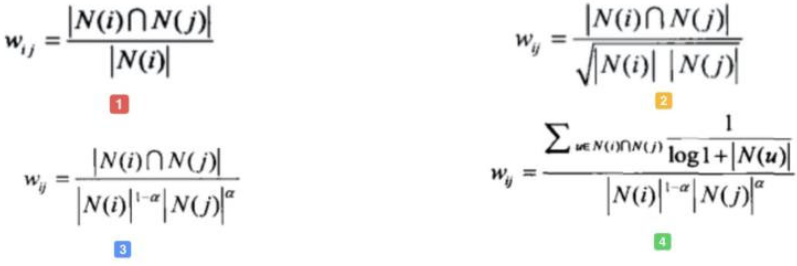

# 新闻推荐
**问题描述**：赛题以新闻APP中的新闻推荐为背景，要求选手根据用户历史浏览点击新闻文章的数据信息预测用户未来点击行为，即用户的最后一次点击的新闻文章，测试集对最后一次点击行为进行了剔除。 

**评价指标:**   
$$
score(user) = \sum_{k=1}^5 \frac{s(user, k)}{k}
$$  
   评估：假如article1就是真实的用户点击文章，也就是article1命中， 则s(user1,1)=1, s(user1,2-4)都是0， 如果article2是用户点击的文章， 则s(user,2)=1/2,s(user,1,3,4,5)都是0。也就是score(user)=命中第几条的倒数。如果都没中， 则score(user1)=0。 这个是合理的， 因为我们希望的就是命中的结果尽量靠前， 而此时分数正好比较高。

**赛题理解：**  
**数据概况：**  该数据来自某新闻APP平台的用户交互数据，包括30万用户，近300万次点击，共36万多篇不同的新闻文章，同时每篇新闻文章有对应的embedding向量表示。为了保证比赛的公平性，从中抽取20万用户的点击日志数据作为训练集，5万用户的点击日志数据作为测试集A，5万用户的点击日志数据作为测试集B

**使用方法：**
Baseline使用协同过滤的方法进行确定


```python
import matplotlib.pyplot as plt
import seaborn as sns
import numpy as np 
import pandas as pd
import time
from tqdm import tqdm
from datetime import datetime
import collections
from collections import defaultdict
import math
import pickle
import warnings
warnings.filterwarnings("ignore")


DATA_PATH = "./data/"
SAVE_PATH = "./checkpoints/"
```

## 节约内存的一个标配函数


```python
def reduce_mem(df):
    """对于数值类型的数据进行内存节省"""
    
    starttime = time.time()
    numerics = ['int16', 'int32', 'int64', 'float16', 'float32', 'float64']
    start_mem = df.memory_usage().sum() / 1024**2  # 统计内存使用情况
    
    for col in df.columns:
        col_type = df[col].dtypes
        if col_type in numerics:
            c_min = df[col].min()
            c_max = df[col].max()
            if pd.isnull(c_min) or pd.isnull(c_max):
                continue
            if str(col_type)[:3] == 'int':
                # 装换数据类型
                if c_min > np.iinfo(np.int8).min and c_max < np.iinfo(np.int8).max:
                    df[col] = df[col].astype(np.int8)
                elif c_min > np.iinfo(np.int16).min and c_max < np.iinfo(np.int16).max:
                    df[col] = df[col].astype(np.int16)
                elif c_min > np.iinfo(np.int32).min and c_max < np.iinfo(np.int32).max:
                    df[col] = df[col].astype(np.int32)
                elif c_min > np.iinfo(np.int64).min and c_max < np.iinfo(np.int64).max:
                    df[col] = df[col].astype(np.int64)
            else:
                if c_min > np.finfo(np.float16).min and c_max < np.finfo(np.float16).max:
                    df[col] = df[col].astype(np.float16)
                elif c_min > np.finfo(np.float32).min and c_max < np.finfo(np.float32).max:
                    df[col] = df[col].astype(np.float32)
                else:
                    df[col] = df[col].astype(np.float64)
                    
    end_mem = df.memory_usage().sum() / 1024**2
    print('-- Mem. usage decreased to {:5.2f} Mb ({:.1f}% reduction),time spend:{:2.2f} min'.format(end_mem,
                                                                                                           100*(start_mem-end_mem)/start_mem,
                                                                                                           (time.time()-starttime)/60))
    return df
```

## 读取采样或全量数据


```python
def get_all_click_sample(data_path, samples = 10000):
    """对数据进行采样"""
    
    all_click = pd.read_csv(data_path + "train_click_log.csv")
    all_user_id = all_click["user_id"].unique()
    sample_user_id =  np.random.choice(all_user_id, 10000)  # 进行无放回的采样数据
    all_click = all_click[all_click["user_id"].isin(sample_user_id)]

    all_click = all_click.drop_duplicates(all_click.columns[:3])
    
    return all_click
```


```python
# 读取点击数据，这里分成线上和线下，如果是为了获取线上提交结果应该讲测试集中的点击数据合并到总的数据中
# 如果是为了线下验证模型的有效性或者特征的有效性，可以只使用训练集
def get_all_click_df(data_path='./data/', offline=True):
    if offline:
        all_click = pd.read_csv(data_path + 'train_click_log.csv')
    else:
        trn_click = pd.read_csv(data_path + 'train_click_log.csv')
        tst_click = pd.read_csv(data_path + 'testA_click_log.csv')

        all_click = trn_click.append(tst_click)
    
    all_click = all_click.drop_duplicates((['user_id', 'click_article_id', 'click_timestamp']))
    return all_click
```


```python
all_click_df = get_all_click_df(offline=False)
```

## 获取用户－文章－点击时间字典


```python
# 根据点击时间获取用户的点击文章序列   {user1: [(item1, time1), (item2, time2)..]...}
def get_user_item_time(click_df):
    
    click_df = click_df.sort_values('click_timestamp')  # 按照时间升序排列
    
    def make_item_time_pair(df):
        return list(zip(df['click_article_id'], df['click_timestamp']))
    
    user_item_time_df = click_df.groupby('user_id')['click_article_id', 'click_timestamp'].apply(lambda x: make_item_time_pair(x))\
                                                            .reset_index().rename(columns={0: 'item_time_list'})
    user_item_time_dict = dict(zip(user_item_time_df['user_id'], user_item_time_df['item_time_list']))
    
    return user_item_time_dict
```

## 获取近期点击最多的文章


```python
def get_item_topk_click(click_df, k):
    
    topk_click = click_df['click_article_id'].value_counts().index[:k]
    
    return topk_click
```

## ItemCF的物品相似度计算
**算法依据**：ItemCF算法并不利用物品的内容属性计算物品之间的相似度， 主要通过分析用户的行为记录计算物品之间的相似度， 该算法认为， 物品a和物品c具有很大的相似度是因为喜欢物品a的用户大都喜欢物品c。改进之后，基于公式四进行编写  



```python
def itemcf_sim(df):
    """计算物品相似度""" 
    
    user_item_time_df = get_user_item_time(df)
    
    i2i_sim = {}
    item_cnt = defaultdict(int)  # 初始值为０

    # 改进权重的基于物品的协同过滤算法
    for user, item_time_list in tqdm(user_item_time_df.items()):
            for i, i_click_time in item_time_list:
                item_cnt[i] += 1  # 统计喜欢item的用户数目
                i2i_sim.setdefault(i, {})
                
                for j, j_click_time in item_time_list:
                    if (i == j):  # 自身和自身之间进行计算相似度
                        continue
                    i2i_sim[i].setdefault(j, 0)  
                    i2i_sim[i][j] += 1/math.log(len(item_time_list) + 1)  # 既喜欢商品i，又喜欢商品j, 同一个用户喜欢的物品就是都喜欢
                    
    i2i_sim_ = i2i_sim.copy()
    for i, related_items in i2i_sim.items():
        for j, wij in related_items.items():
            i2i_sim_[i][j] = wij/math.sqrt(item_cnt[i] * item_cnt[j])
    
    # 保存数据
    pickle.dump(i2i_sim_, open(SAVE_PATH + "itemCF_sim.pkl", "wb"))
    
    return i2i_sim_
```


```python
i2i_sim = itemcf_sim(all_click_df)
```

    100%|██████████| 250000/250000 [00:24<00:00, 10295.64it/s]


## ItemCF的文章推荐


```python
def item_based_recommend(user_id, user_item_time_dict, i2i_sim, sim_item_topk, recall_item_num, item_topk_click):
    """
    """
    user_hist_items = user_item_time_dict[user_id]  # 找出用户历史文章点击
    user_hist_items_ = {user_id for user_id, _ in user_hist_items}
    
    
    item_rank = {}
    for loc, (i, click_time) in enumerate(user_hist_items):
        # 找出用户度过文章中最相似的文章回合,从高到底
        for j, wij in sorted(i2i_sim[i].items(), key=lambda x:x[1], reverse=True)[:sim_item_topk]:  # 选择与当前文章最相似的k篇文章
            if j in user_hist_items_:  # 已经存在的商品
                continue
                
            item_rank.setdefault(j, 0) # 召回
            item_rank[j] += wij
    
    # 不足10个商品，进行热门商品补全
    if len(item_rank) < recall_item_num:
        for i, item in enumerate(item_topk_click):
            if item in item_rank.items():
                continue
            item_rank[item] = - i - 100  # 后补全的商品应的重要性应不能高于已推荐商品的重要性
    
            if len(item_rank) == recall_item_num:
                break
                
    item_rank = sorted(item_rank.items(), key=lambda x:x[1], reverse=True)[:recall_item_num]

    return item_rank
```

## 给每位用户根据物品的协同过滤推荐文章


```python
# 统计召回
user_recall_items_dict = collections.defaultdict(dict)

# 用户物品字典
user_item_time_dict = get_user_item_time(all_click_df)

i2i_sim = pickle.load(open(SAVE_PATH + "itemCF_sim.pkl", "rb"))

# 相似文章数量
sim_item_topk = 10

# 每一个用户召回文章数量
recall_item_num = 10

# 用户热度补全
item_topk_click = get_item_topk_click(all_click_df, k = 50)

# 为用户推荐商品
for user in tqdm(all_click_df["user_id"].unique()):
    user_recall_items_dict[user] = item_based_recommend(user, user_item_time_dict, i2i_sim, sim_item_topk, recall_item_num, item_topk_click)
```

    100%|██████████| 250000/250000 [43:22<00:00, 96.04it/s]  


## 装换数据到DataFrame


```python
# 将字典的形式转换成df
user_item_score_list = []

for user, items in tqdm(user_recall_items_dict.items()):
    for item, score in items:
        user_item_score_list.append([user, item, score])

recall_df = pd.DataFrame(user_item_score_list, columns=['user_id', 'click_article_id', 'pred_score'])
```

    100%|██████████| 250000/250000 [00:04<00:00, 50667.56it/s]


```python
recall_df
```


<div>
<style scoped>
    .dataframe tbody tr th:only-of-type {
        vertical-align: middle;
    }

    .dataframe tbody tr th {
        vertical-align: top;
    }

    .dataframe thead th {
        text-align: right;
    }
</style>
<table border="1" class="dataframe">
  <thead>
    <tr style="text-align: right;">
      <th></th>
      <th>user_id</th>
      <th>click_article_id</th>
      <th>pred_score</th>
    </tr>
  </thead>
  <tbody>
    <tr>
      <th>0</th>
      <td>199999</td>
      <td>276970</td>
      <td>0.172377</td>
    </tr>
    <tr>
      <th>1</th>
      <td>199999</td>
      <td>158536</td>
      <td>0.106969</td>
    </tr>
    <tr>
      <th>2</th>
      <td>199999</td>
      <td>286321</td>
      <td>0.097774</td>
    </tr>
    <tr>
      <th>3</th>
      <td>199999</td>
      <td>108855</td>
      <td>0.092462</td>
    </tr>
    <tr>
      <th>4</th>
      <td>199999</td>
      <td>162655</td>
      <td>0.091407</td>
    </tr>
    <tr>
      <th>...</th>
      <td>...</td>
      <td>...</td>
      <td>...</td>
    </tr>
    <tr>
      <th>2499995</th>
      <td>200000</td>
      <td>187005</td>
      <td>0.071191</td>
    </tr>
    <tr>
      <th>2499996</th>
      <td>200000</td>
      <td>50573</td>
      <td>0.071180</td>
    </tr>
    <tr>
      <th>2499997</th>
      <td>200000</td>
      <td>63344</td>
      <td>0.071180</td>
    </tr>
    <tr>
      <th>2499998</th>
      <td>200000</td>
      <td>255153</td>
      <td>0.068034</td>
    </tr>
    <tr>
      <th>2499999</th>
      <td>200000</td>
      <td>195603</td>
      <td>0.065900</td>
    </tr>
  </tbody>
</table>
<p>2500000 rows × 3 columns</p>
</div>


## 生成submit提交文件


```python
def submit(recall_df, topk=5, model_name=None):
    
    recall_df = recall_df.sort_values(by=['user_id', 'pred_score'])
    recall_df['rank'] = recall_df.groupby(['user_id'])['pred_score'].rank(ascending=False, method='first')
    
#     判断是不是每个用户都有5篇文章及以上
    tmp = recall_df.groupby('user_id').apply(lambda x: x['rank'].max())
    assert tmp.min() >= topk
    
    del recall_df['pred_score']
    submit = recall_df[recall_df['rank'] <= topk].set_index(['user_id', 'rank']).unstack(-1).reset_index()
    
    submit.columns = [int(col) if isinstance(col, int) else col for col in submit.columns.droplevel(0)]
    # 按照提交格式定义列名
    submit = submit.rename(columns={'': 'user_id', 1: 'article_1', 2: 'article_2', 
                                                  3: 'article_3', 4: 'article_4', 5: 'article_5'})
    
    save_name = SAVE_PATH + model_name + '_' + datetime.today().strftime('%m-%d') + '.csv'
    submit.to_csv(save_name, index=False, header=True)
```


```python
# 获取测试集
tst_click = pd.read_csv(DATA_PATH + 'testA_click_log.csv')
tst_users = tst_click['user_id'].unique()
tst_users
```


    array([249999, 249998, 249997, ..., 200002, 200001, 200000])


```python
# 从所有的召回数据中将测试集中的用户选出来
tst_recall = recall_df[recall_df['user_id'].isin(tst_users)]
tst_recall
```


<div>
<style scoped>
    .dataframe tbody tr th:only-of-type {
        vertical-align: middle;
    }

    .dataframe tbody tr th {
        vertical-align: top;
    }

    .dataframe thead th {
        text-align: right;
    }
</style>
<table border="1" class="dataframe">
  <thead>
    <tr style="text-align: right;">
      <th></th>
      <th>user_id</th>
      <th>click_article_id</th>
      <th>pred_score</th>
    </tr>
  </thead>
  <tbody>
    <tr>
      <th>2000000</th>
      <td>249999</td>
      <td>234698</td>
      <td>0.280279</td>
    </tr>
    <tr>
      <th>2000001</th>
      <td>249999</td>
      <td>95716</td>
      <td>0.245980</td>
    </tr>
    <tr>
      <th>2000002</th>
      <td>249999</td>
      <td>336223</td>
      <td>0.244608</td>
    </tr>
    <tr>
      <th>2000003</th>
      <td>249999</td>
      <td>160132</td>
      <td>0.227058</td>
    </tr>
    <tr>
      <th>2000004</th>
      <td>249999</td>
      <td>59057</td>
      <td>0.205233</td>
    </tr>
    <tr>
      <th>...</th>
      <td>...</td>
      <td>...</td>
      <td>...</td>
    </tr>
    <tr>
      <th>2499995</th>
      <td>200000</td>
      <td>187005</td>
      <td>0.071191</td>
    </tr>
    <tr>
      <th>2499996</th>
      <td>200000</td>
      <td>50573</td>
      <td>0.071180</td>
    </tr>
    <tr>
      <th>2499997</th>
      <td>200000</td>
      <td>63344</td>
      <td>0.071180</td>
    </tr>
    <tr>
      <th>2499998</th>
      <td>200000</td>
      <td>255153</td>
      <td>0.068034</td>
    </tr>
    <tr>
      <th>2499999</th>
      <td>200000</td>
      <td>195603</td>
      <td>0.065900</td>
    </tr>
  </tbody>
</table>
<p>500000 rows × 3 columns</p>
</div>


```python
# 生成提交文件
submit(tst_recall, topk=5, model_name='itemcf_baseline')
```

## 参考
[pandas内存优化](https://blog.csdn.net/weiyongle1996/article/details/78498603)


```python
!head -10 checkpoints/itemcf_baseline_12-08.csv
```

    user_id,article_1,article_2,article_3,article_4,article_5
    200000,237870,194619,194935,314048,195773
    200001,64329,272143,199198,324823,166581
    200002,300128,300923,61375,293301,298035
    200003,337143,272143,156619,235230,158536
    200004,235870,235616,336223,261612,156964
    200005,69932,160974,156964,160417,158536
    200006,199197,284547,235230,183176,206934
    200007,289003,157478,97530,218028,66672
    200008,235870,300082,156560,64409,336223

